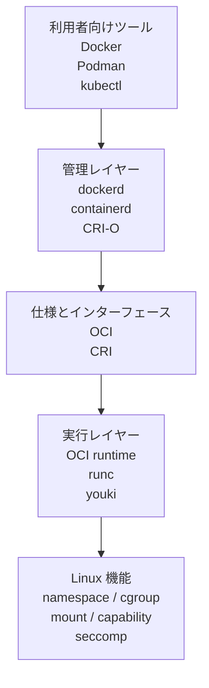
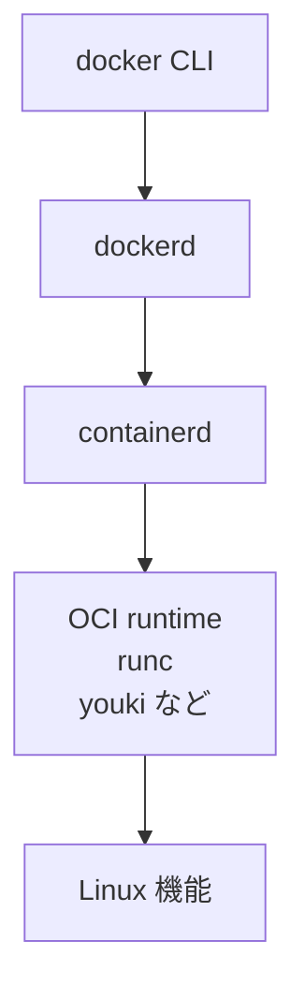
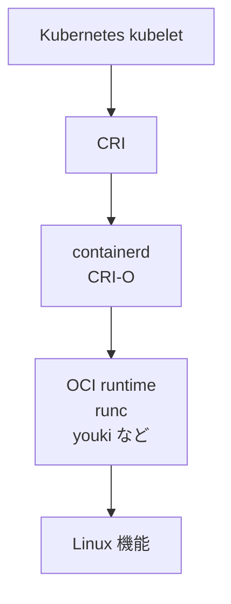

# 第0章: コンテナ技術の全体像

このページでは、細かい Linux 機能に入る前に、まず「コンテナ技術全体がどういう層でできているか」を整理します。

::: tip 最初に一言で言うと
container は Docker そのものではありません。  
Linux の隔離機能を使って process を実行するための技術群であり、Docker はその代表的な利用者向けツールの 1 つです。
:::

## なぜ container 技術が必要になったのか

container 技術が広く使われるようになった背景には、次のような現実的な困りごとがあります。

- 開発環境では動くのに、本番環境では依存関係や設定差分で動かない
- 1 台のホストで複数アプリを動かすと、ライブラリやポートや設定がぶつかる
- VM で完全に分けると分かりやすいが、起動や運用のコストが重い
- 配布や再現をもっと簡単にしたい

つまり container 技術は、「隔離そのものが目的」というより、

- 環境差分を減らす
- 依存関係の衝突を避ける
- 軽量に分離する
- 同じ実行単位を配布しやすくする

ために育ってきた技術だと見ると分かりやすいです。

## container 技術で何ができるのか

container 技術を使うと、同じホスト Linux 上で動いていても、process ごとにかなり違う見え方や制約を与えられます。

たとえば:

- アプリごとに別の filesystem 世界を見せる
- アプリごとに別の process 一覧や hostname や network を見せる
- CPU や memory や process 数に上限を付ける
- root に見えていても、使える権限や syscall を絞る

結果として、

- 同じホストで複数アプリをぶつけずに動かしやすい
- 開発、CI、本番で同じ実行イメージを使いやすい
- アプリの配布単位をそろえやすい

という利点が生まれます。

## container 技術のざっくりした歴史

container 技術は、突然 Docker から始まったわけではありません。

考え方としては以前から、

- `chroot` のように見える filesystem を切り替える仕組み
- FreeBSD `jail` のように process をより強く分離する仕組み

がありました。

その後 Linux では、

- `namespace` による「見える世界」の分離
- `cgroup` による「使える資源」の制御

が整ってきて、隔離された process をより実用的に作れるようになりました。

その流れの上で、

- `LXC` などが Linux container を実用化し
- `Docker` が image 配布や CLI 体験を含めて広く普及させ
- さらに `OCI`, `containerd`, `CRI`, `Kubernetes` などでエコシステムが整理されてきた

と考えると全体像が追いやすいです。

## container 技術は 1 個の製品ではない

初学者が最初につまずきやすいのは、`container`、`Docker`、`runc`、`Kubernetes` が全部同じ階層の言葉に見えてしまうことです。

しかし実際には、役割がかなり違います。

- `container`: Linux の機能を使って隔離された process を作る考え方や技術
- `Docker`: container を扱いやすくする利用者向けツール群
- `containerd`, `CRI-O`: container を管理する中間レイヤー
- `runc`, `youki`: 実際に Linux 機能を呼んで process を起動する `OCI runtime`
- `CRI`: Kubernetes が runtime 管理レイヤーを呼ぶためのインターフェース
- `OCI`: container image や runtime の標準仕様

つまり、container 技術は「1 つの名前の製品」ではなく、複数の層の組み合わせです。

## レイヤーごとの見取り図

かなり大づかみに描くと、次のように整理できます。

この教材で本当に知りたいのは、最下段の Linux 機能が何をしていて、その上にある runtime がどうそれを組み合わせるかです。

## Docker の場合はどう見ればよいか

`Docker` という言葉だけを見ると、container を 1 人で全部やっているように見えます。  
ですが内部では、役割を分けて考えたほうが理解しやすいです。

ここで言いたいのは、`dockerd` 単体を詳しく覚えることではありません。

大事なのは次の点です。

- `Docker` は container 技術全体の代表例の 1 つである
- その内部では、管理レイヤーと runtime レイヤーが分かれている
- 実際に Linux 機能を呼び出して process を起動するのは `OCI runtime` 層である

## Docker 以外ではどうなるか

container 技術は Docker だけのものではありません。

たとえば:

- `Podman` のような別の利用者向けツールがある
- `CRI-O` のような別の管理レイヤー実装がある
- `runc` 以外にも `youki` や `crun` などの OCI runtime 実装がある

つまり、上のツールや中間レイヤーは複数あっても、下で使う Linux 機能や OCI runtime という考え方は共通しています。

## Kubernetes と CRI はどこに出てくるか

ここで `CRI` も位置づけておきます。

`CRI` は Container Runtime Interface の略で、Kubernetes が runtime 管理レイヤーを呼ぶためのインターフェースです。  
これは `Docker` そのものを説明するための言葉というより、Kubernetes 側の接続面を説明するための言葉です。

Kubernetes の文脈では、大づかみに次のように見られます。

ここで重要なのは:

- `CRI` は Kubernetes と runtime 管理レイヤーの間の約束事
- `OCI` は image や runtime の標準仕様
- `CRI` と `OCI` は同じものではない

ということです。

## この教材でどこまで扱うか

この教材は、`dockerd` や `containerd` や `CRI-O` の実装詳細を追うことが主目的ではありません。

中心に置くのは次の 2 点です。

1. container の正体が Linux 上の隔離された process であること
2. その process を `OCI runtime` がどう組み立てて起動するか

そのため、ここから先の章ではまず Linux の根幹である:

- process
- syscall
- namespace
- cgroup
- mount / rootfs
- capability
- seccomp

を順番に押さえます。

`OCI runtime` 自体の詳しい説明は、第9章で改めて扱います。

## このページを踏まえた読み方

ここまでで、container 技術の大きな地図は持てました。  
次の第1章からは、いったん上のツール群から少し離れて、「そもそも container の正体は Linux の何なのか」に集中します。

必要になったら:

- Docker の代表例に戻る
- Kubernetes と CRI の位置づけを思い出す
- 第9章で OCI runtime を詳しく確認する

という読み方で十分です。

## このページで理解すべきこと

- container は Docker そのものではなく、複数レイヤーから成る技術群であること
- `Docker`, `containerd`, `CRI-O`, `runc`, `youki`, `CRI`, `OCI` は役割が違うこと
- 実際に container process を起動する低レイヤーが `OCI runtime` であること
- その下で本当に効いているのは Linux の隔離・制御機能であること
