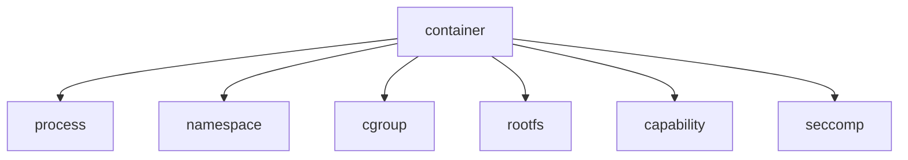

# 第1章: コンテナの正体を先に掴む

::: warning 準備中
本文は次の執筆フェーズで追加します。このページでは、最終的に全体像を先に掴める構成にします。
:::

## コンテナは VM ではない

## コンテナは Linux 上のプロセスである

## 普通のプロセスと何が違うのか

## Docker run の裏側を超ざっくり見る

## 図解: コンテナを支える Linux 機能

## この章で理解すべきこと

- コンテナは別 OS ではなく隔離されたプロセスだという全体像
- 以降の章で学ぶ Linux 機能の役割分担
