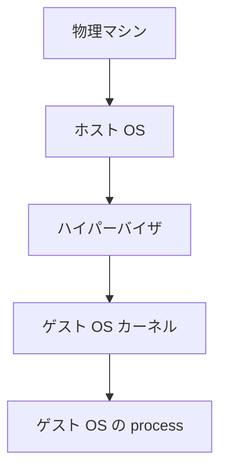
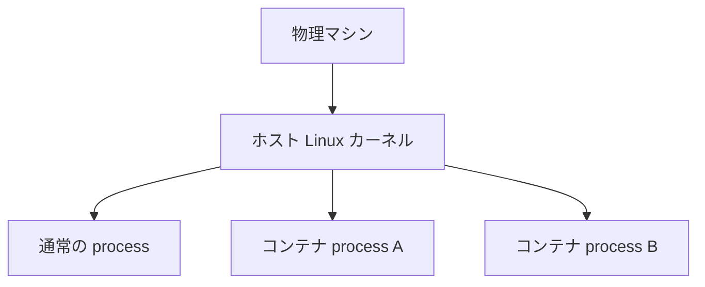
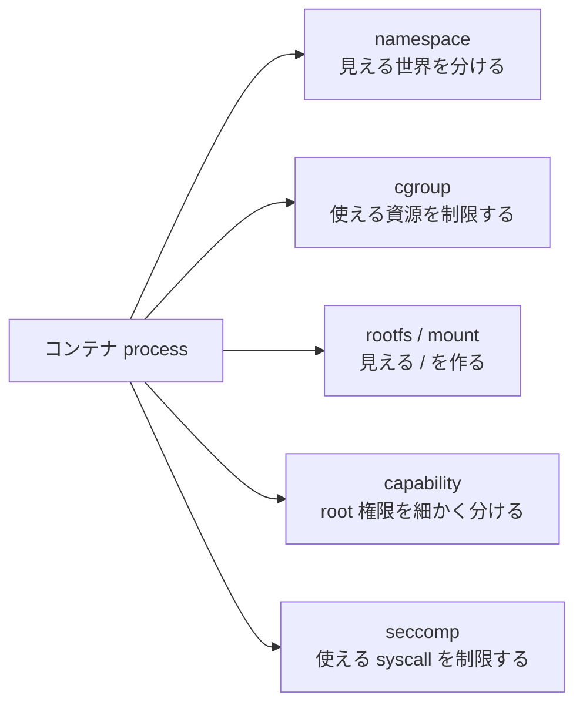

# 第1章: コンテナの正体を先に掴む

前のページでは、container 技術全体の中で Docker、管理レイヤー、OCI runtime、Linux 機能がどう並ぶかを見ました。

この章からは、その地図のいちばん下にある「Linux 側の根幹」に視点を移します。

::: tip 最初に一言で言うと
コンテナは、Linux の上で動く「隔離されたプロセス」です。  
VM のように別の OS カーネルを起動しているわけではありません。
:::

利用者からは container は小さな仮想マシンのように見えることがあります。

しかし実際には、その正体は Linux の process です。ただし普通の process ではなく、以下の仕組みで見える世界と使える権限が絞られています。

- `namespace`: 見える世界を分ける
- `cgroup`: 使える資源を制限する
- `rootfs`: 見える `/` の中身を用意する
- `mount`: ファイルシステムをつなぐ
- `capability`: root 権限を細かく分ける
- `seccomp`: 使える syscall を制限する

この章では、細かい定義に入る前に、container の正体を Linux の言葉でつかみます。

## この章で先に意味を押さえる単語

- `Linux`: この教材では主に Linux カーネルが提供する機能を指す
- `process`: 実行中のプログラム
- `PID`: process に付く識別番号
- `container`: Linux の機能で隔離された process
- `VM`: 別の OS カーネルを起動する仮想マシン
- `root`: 強い管理者権限を持つユーザー。`/` を意味する root directory とは別物

## なぜ最初に全体像が必要なのか

コンテナの仕組みを学び始めると、すぐに大量の用語が出てきます。

- process
- PID
- syscall
- namespace
- cgroup
- mount
- rootfs
- capability
- seccomp
- OCI runtime

このとき初学者が混乱しやすい理由は、各用語が「全部コンテナっぽい話」に見えてしまうからです。

ですが、実際には役割がかなり違います。

- `namespace` は「何が見えるか」を決める
- `cgroup` は「どこまで使えるか」を決める
- `rootfs` は「どんなファイル群が見えるか」を決める
- `capability` は「root でも何が許されるか」を細かく決める
- `seccomp` は「どの syscall を呼んでよいか」を決める

まず役割分担を見てから個別の章に入ると、理解しやすくなります。

## コンテナは VM ではない

`VM` は Virtual Machine の略です。仮想マシンでは、ホスト OS の上でハイパーバイザなどを使い、その中で「別の OS カーネル」ごと起動します。

つまり VM では、次のような構造になります。



一方、コンテナでは別のカーネルは起動しません。ホストの Linux カーネルを、そのまま複数の process が共有します。



ここが最重要です。

::: warning よくある誤解
コンテナは「軽量 VM」ではありません。  
見た目が VM っぽいだけで、仕組みの中心は Linux の process 分離です。
:::

## コンテナは Linux 上のプロセスである

`process` とは、実行中のプログラムです。たとえば `bash` も `nginx` も `python` も、動き始めると process になります。

コンテナの中で動いている `bash` も、ホストから見ればただの process です。  
たとえば Docker で起動したコンテナも、ホスト側から `ps aux` などで見ると 1 個以上の process として見えます。

Docker を使うと、利用者は「コンテナ」という単位で操作します。

```bash
docker run --rm -it ubuntu bash
```

しかし Linux カーネルの視点では、これは結局「ある条件で起動された process」です。

その「ある条件」とは、たとえば次のようなものです。

- 別の PID 空間を見せる
- 別の mount 空間を見せる
- 別のネットワーク設定を見せる
- メモリや CPU 使用量に上限を付ける
- ホストの `/` ではなく専用の rootfs を見せる
- 強い権限を落とす
- 危険な syscall を禁止する

つまり、コンテナは新しい種類の実行単位ではなく、既存の process に Linux の隔離機能を重ねたものです。

## 普通のプロセスと何が違うのか

普通の process とコンテナ process の違いを、役割ごとに分けてみましょう。

| 観点 | 普通の process | コンテナ process |
| --- | --- | --- |
| 見える process | ホスト全体に近い | PID namespace で分離される |
| 見える `/` | ホストの rootfs | 専用 rootfs が見える |
| 見える hostname | ホスト名 | 別 hostname を見せられる |
| ネットワーク | ホスト共有が多い | 別 network namespace を持てる |
| 使えるメモリ | 制限なしのことが多い | cgroup で制限可能 |
| 権限 | root は非常に強い | capability で削られることが多い |
| syscall | 基本的に広く使える | seccomp で制限可能 |

この表から分かるように、コンテナは「別の何か」ではなく、「普通の process の見え方と権限を変えたもの」です。

## コンテナを支える Linux 機能の役割分担

ここで、以降の章の予告を兼ねて、主要機能を一度並べます。



### namespace

`namespace` は、process から見える世界を分ける仕組みです。

たとえば:

- PID namespace: どの process が見えるか
- mount namespace: どの mount 構成が見えるか
- network namespace: どの NIC や IP が見えるか
- UTS namespace: hostname が何に見えるか

### cgroup

`cgroup` は process 群のリソースを制限・計測する仕組みです。

たとえば:

- メモリ 256MB まで
- CPU は 0.5 コア相当まで
- process 数は 100 個まで

### rootfs と mount

`rootfs` は、その process に見せたい `/` の中身です。  
コンテナイメージから展開されたファイル群が、最終的には rootfs として使われます。

`mount` は、ファイルシステムやディレクトリをある場所に接続する操作です。  
コンテナでは mount namespace と組み合わせて、「この process にはこの `/` を見せる」ということを行います。

### capability

Linux の `root` は本来とても強力です。  
`capability` は、その強い root 権限を細かい部品に分解したものです。

コンテナでは、「コンテナ内では root に見えるが、ホスト root と同じ強さではない」という状態を作るために capability がよく使われます。

### seccomp

`seccomp` は、使ってよい syscall を絞る仕組みです。  
namespace や cgroup が「世界」や「資源」を制御するのに対して、seccomp は「何ができるか」を syscall 単位で制御します。

## この章の位置づけ

container 技術全体のレイヤー構造や Docker などの具体例は、前のページで先に見ました。  
ここから先は、その土台になっている Linux の機能を 1 つずつ理解していきます。

つまり流れとしては:

- 第0章: container 技術全体の地図を見る
- 第1章から第8章: Linux 側の根幹を理解する
- 第9章: それらを組み合わせる OCI runtime 層を詳しく見る

という構成です。

## たとえ話で整理する

初学者向けには、次のたとえが役に立ちます。

- `process`: 実行中の作業者
- `namespace`: その作業者に見せる部屋の景色
- `cgroup`: その作業者に渡す電気・水・机の大きさ
- `rootfs`: その作業者が入る部屋の中身
- `mount`: 本棚や引き出しをどこに置くか
- `capability`: マスターキーをどこまで渡すか
- `seccomp`: 許可された操作メニュー

このたとえの意図は、「全部が同じ種類の話ではない」と分けて考えることです。

## 実験: Docker コンテナもホストから見れば process

### 目的

コンテナの中で動くものが、ホストから見ると process であることを観察します。

### 実行コマンド

```bash
docker run -d --name demo-nginx nginx
docker ps
docker inspect --format '{{.State.Pid}}' demo-nginx
ps -fp $(docker inspect --format '{{.State.Pid}}' demo-nginx)
docker rm -f demo-nginx
```

### 期待される出力の例

```text
3f8a...   nginx   "/docker-entrypoint.…"   Up 5 seconds
24831
UID   PID  PPID  C STIME TTY   TIME CMD
root 24831 24780 0 12:34 ?     00:00:00 nginx: master process nginx -g daemon off;
```

### 出力の読み方

- `docker inspect` で出た PID は、ホスト側の PID です
- その PID を `ps` で引くと、普通の process として見えます
- Docker は「コンテナ」を管理していますが、カーネルから見ると process です

### 何が理解できるか

- コンテナは Linux 上の process である
- Docker は process を隔離・管理しやすく見せているだけである

### 注意点

- Docker がインストールされている環境で実行してください
- rootless Docker などでは出力が少し異なることがあります

## よくある誤解

### 誤解1: コンテナは VM の軽量版である

半分正しく、半分誤りです。  
「使い勝手」の面では VM の代わりに使える場面がありますが、仕組みは別物です。

### 誤解2: コンテナの中に OS が 1 台入っている

一般にコンテナイメージに入っているのは、OS 全体ではなく「ユーザーランドのファイル群」です。  
Linux カーネルそのものは、ホストのものを共有します。

### 誤解3: Docker が全部やっている

Docker は上位ツールです。  
実際に低レイヤーの設定を行うのは、containerd や OCI runtime などを含むレイヤーです。

## この章で理解すべきこと

- コンテナは VM ではなく、Linux 上の隔離された process である
- namespace は見える世界を分ける
- cgroup は使える資源を制限する
- rootfs は見える `/` の中身である
- capability は root 権限を細かく分ける
- seccomp は使える syscall を制限する
- Docker はこれらの Linux 機能を組み合わせてコンテナを起動している
