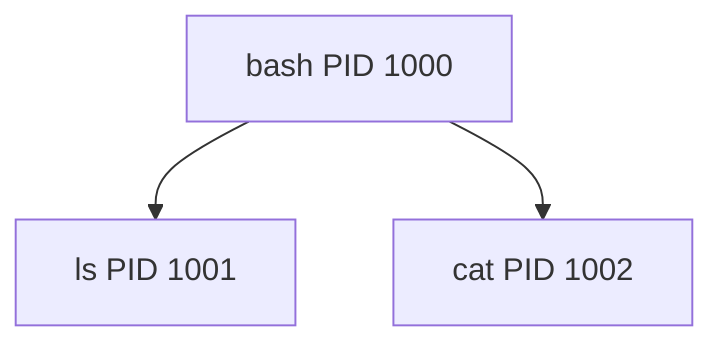

# 第2章: process と /proc

コンテナを理解するうえで、最初の足場になるのが `process` です。  
コンテナが「隔離された process」だと言うなら、まず process そのものを分かっていないと話が進みません。

この章では、Linux における process の基本と、それを観察する窓口である `/proc` を学びます。

## この章で先に意味を押さえる単語

- `program`: ディスク上にある実行ファイルやコード
- `process`: 実行中の program
- `PID`: Process ID。process の識別番号
- `PPID`: Parent Process ID。親 process の PID
- `procfs`: `/proc` のこと。process やカーネル状態を見せる仮想ファイルシステム

## なぜ process を最初に学ぶのか

Docker を使っていると、つい「コンテナ」という単位で考えがちです。

ですが Linux カーネルは、`container` という特別な実行単位を持っていません。  
カーネルが直接扱っているのは、あくまで process です。

なので、次の順で理解すると自然です。

1. process とは何か
2. process はどう観察できるか
3. コンテナもホストから見れば process である

## process とは何か

`process` とは、実行中のプログラムです。

たとえば:

- `bash` を起動すると `bash` process ができます
- `python app.py` を実行すると Python process ができます
- `nginx` を起動すると nginx process ができます

同じプログラムでも、複数回起動すれば複数の process になります。

たとえばターミナルを 2 つ開いて別々に `bash` が動いていれば、`bash` という同じプログラムの別 process が 2 個ある状態です。

### program と process の違い

ここはよく混同されます。

- `program`: ディスク上にある実行ファイルやコード
- `process`: それがメモリに読み込まれて実行中の状態

言い換えると、料理本が `program`、実際に料理している人が `process` です。

## PID とは何か

`PID` は Process ID の略で、各 process に付く識別番号です。

Linux では、それぞれの process を区別するために PID が使われます。

たとえば:

- PID 1
- PID 2456
- PID 30102

といった番号です。

`ps` や `top` で process を見ると、必ず PID が表示されます。

### PID 1 の特別さ

Linux では、PID 1 は特別な役割を持つ process です。  
ホスト OS では多くの場合 `systemd` や `init` が PID 1 です。

コンテナの中でも PID namespace を使うと、「そのコンテナの中から見た PID 1」が存在します。  
これがコンテナで `ps` を打ったときに、アプリ自身が PID 1 に見える理由です。

## 親プロセス・子プロセスとは何か

process は、別の process から作られることがあります。  
このとき:

- 作った側: 親プロセス
- 作られた側: 子プロセス

と呼びます。

たとえば、今あなたが開いている shell (`bash`) から `ls` を実行すると、

- `bash` が親
- `ls` が子

になります。

この親子関係は、PID とは別に `PPID` で表されます。`PPID` は Parent Process ID です。



## まずは process を見てみる

Linux では、次のようなコマンドで process を観察できます。

- `ps`
- `top`
- `pstree`
- `/proc/<pid>`

### `ps aux`

`ps aux` は、現在動いている process を一覧表示する代表的なコマンドです。

```bash
ps aux | head
```

典型的には以下のような列が出ます。

- `USER`: 誰の権限で動いているか
- `PID`: process の ID
- `%CPU`: CPU 使用率
- `%MEM`: メモリ使用率
- `COMMAND`: 何を実行しているか

### `echo $$`

今いる shell 自身の PID を知るには `echo $$` が便利です。

```bash
echo $$
```

`$$` は「現在の shell の PID」を意味します。

### `top`

`top` は、動的に process の状態を観察するためのコマンドです。

```bash
top
```

CPU を食っている process、メモリを多く使っている process をリアルタイムで見られます。

### `pstree`

`pstree` は、親子関係を木構造で見せてくれます。

```bash
pstree -p
```

`-p` を付けると PID も表示されます。

## `/proc` は何か

`/proc` は `procfs` と呼ばれる特別な仮想ファイルシステムです。

ここで重要なのは、「ディスク上の普通のファイル」ではないという点です。  
`/proc` の中身は、カーネルがその場で process やシステムの情報を見せているものです。

つまり `/proc` は:

- process 情報を見る窓口
- カーネルの状態を見る窓口
- いくつかの設定を読み書きする窓口

です。

### `/proc/<pid>` の意味

各 process には `/proc/<pid>` というディレクトリがあります。

たとえば、自分の shell の PID が 4242 なら:

```text
/proc/4242
```

のようなディレクトリが存在します。

この中には、その process に関する多くの情報があります。

- `status`: 状態の要約
- `cmdline`: 起動コマンド
- `environ`: 環境変数
- `cwd`: 現在の作業ディレクトリ
- `exe`: 実行ファイルへのリンク
- `fd/`: 開いているファイルディスクリプタ
- `mounts`: 見えている mount 一覧
- `ns/`: 所属 namespace

::: tip 重要
後の章で `mounts` や `ns/` も使います。  
つまり `/proc` は process 章だけで終わる話ではなく、コンテナ理解全体の観察窓口です。
:::

## `cat /proc/$$/status` で何が見えるか

自分の shell の `status` を見ると、多くの情報がまとまっています。

```bash
cat /proc/$$/status
```

見どころの例:

- `Name`: process 名
- `Pid`: 自分の PID
- `PPid`: 親の PID
- `Uid` / `Gid`: ユーザーとグループ
- `State`: 実行状態
- `Threads`: スレッド数
- `CapEff`: 有効 capability
- `Seccomp`: seccomp の状態

この 1 ファイルだけでも、後の章で使う情報がいくつも入っています。

## `ls /proc/$$` で process の観察窓口を見る

```bash
ls /proc/$$
```

大量のファイルやディレクトリが見えるはずです。  
これは「実行中 process の状態を、ファイルとして読めるようにしている」と考えると分かりやすいです。

Linux の思想では、「多くのものをファイルとして扱う」ことで統一感を出します。  
`/proc` はその代表例です。

## procfs と sysfs の違いを先に軽く触れる

この教材では `procfs` と `sysfs` の両方が出てきます。

- `procfs` (`/proc`): process やカーネル状態を見せる
- `sysfs` (`/sys`): デバイスやカーネルサブシステム情報を見せる

この章で主に使うのは `procfs` です。  
`sysfs` は cgroup やデバイスの話と関係するため、第6章以降で再登場します。

## コンテナもホストから見ると process である

ここまで学んだことをコンテナに戻すと、見え方がぐっと整理されます。

たとえばコンテナ内で `nginx` が動いているとします。  
コンテナの中ではそれは「コンテナのプロセス」です。

しかしホストから見ると:

- ちゃんと PID を持つ
- `/proc/<pid>` が存在する
- `ps` に出る
- 親子関係を持つ

という、ただの process です。

つまりコンテナは Linux の process モデルの外にいるのではなく、その内側にいます。

```mermaid
flowchart LR
  A[ホスト Linux]
  B[通常の process]
  C[コンテナ process]
  D[/proc/<pid>]
  A --> B
  A --> C
  C --> D
```

## 実験: 自分の shell の process 情報を読む

### 目的

自分が今使っている shell も Linux process であり、`/proc` から詳細を読めることを確認します。

### 実行コマンド

```bash
echo $$
cat /proc/$$/status
ls /proc/$$ | head
readlink /proc/$$/exe
pwd
readlink /proc/$$/cwd
```

### 期待される出力の例

```text
18452
Name:   bash
State:  S (sleeping)
Pid:    18452
PPid:   17120
...
/usr/bin/bash
/home/ubuntu
/home/ubuntu
```

### 出力の読み方

- `Pid` は自分自身の PID
- `PPid` は親 shell や terminal multiplexer など
- `exe` は実際の実行ファイル
- `cwd` は現在の作業ディレクトリ

### 何が理解できるか

- process には PID がある
- process は親子関係を持つ
- `/proc/<pid>` に多くの状態がぶら下がっている

### 注意点

- shell が `bash` 以外の場合、`Name` や `exe` は異なります
- 環境によって `State` は多少変わります

## 実験: process の親子関係を見る

### 目的

shell が子 process を起動する様子を観察します。

### 実行コマンド

```bash
echo "shell pid: $$"
pstree -p $$
bash -c 'echo "child shell pid: $$"; sleep 3' &
sleep 1
pstree -p $$
wait
```

### 期待される出力の例

```text
shell pid: 18452
bash(18452)
child shell pid: 18510
bash(18452)-+-bash(18510)---sleep(18511)
            `-pstree(18512)
```

### 出力の読み方

- 元の shell から子の `bash` が作られている
- 子 shell の中でさらに `sleep` が動いている
- 親子関係が木として見える

### 何が理解できるか

- process は親から子が作られる
- Linux は process を木構造で管理している

### 注意点

- `pstree` が入っていない場合は `sudo apt install psmisc` が必要です

## 実験: コンテナの PID をホストから見る

### 目的

コンテナがホストからは 1 個の process 群として見えることを確認します。

### 実行コマンド

```bash
docker run -d --name demo-sleep ubuntu sleep 300
docker inspect --format '{{.State.Pid}}' demo-sleep
cat /proc/$(docker inspect --format '{{.State.Pid}}' demo-sleep)/status | head
docker rm -f demo-sleep
```

### 期待される出力の例

```text
24901
Name:   sleep
Umask:  0022
State:  S (sleeping)
Tgid:   24901
Pid:    24901
PPid:   24860
```

### 出力の読み方

- `docker inspect` で得た PID に対して `/proc/<pid>` を読める
- つまりコンテナ内 process は、ホストでは普通に Linux process として存在する

### 何が理解できるか

- コンテナも process モデルの上にある
- `/proc` はコンテナ理解の観察窓口として使える

### 注意点

- Docker 環境が必要です
- コンテナのメイン process が終了すると PID は消えます

## よくある誤解

### 誤解1: `/proc` はディスク上のログ置き場である

違います。`/proc` は仮想ファイルシステムで、カーネルが動的に見せている情報です。

### 誤解2: PID はシステム全体で絶対に 1 つだけの番号である

ホスト視点ではそう見えますが、PID namespace があると「ある process から見た PID」は変わり得ます。  
これは第4章で扱います。

### 誤解3: コンテナの中の process はホストからは見えない

ホストからは見えます。  
ただし namespace により、コンテナの中と外で「見え方」が違います。

## この章で理解すべきこと

- process は実行中のプログラムである
- PID は process の識別番号である
- process は親子関係を持つ
- `/proc` は process やカーネル状態を見せる仮想ファイルシステムである
- `/proc/<pid>` はコンテナ理解の重要な観察窓口である
- コンテナもホストから見れば Linux process である
