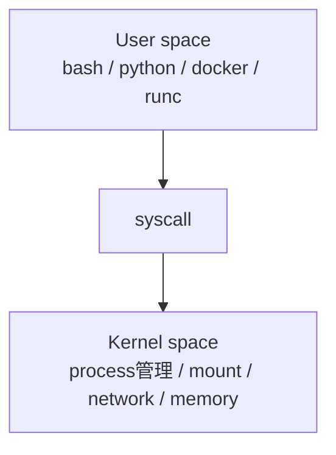
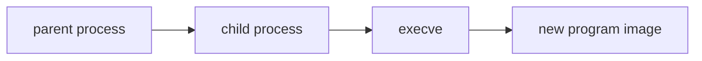

# 第3章: syscall と user space / kernel space

process を理解したら、次に必要なのは「その process がどうやってカーネルに仕事を頼むのか」です。

コンテナ runtime は Linux 機能を使ってコンテナを作ります。  
では、その「使う」とは具体的に何を意味するのでしょうか。

答えは、`syscall` を呼ぶことです。

## なぜ syscall を学ぶのか

コンテナの低レイヤーを理解するとき、`namespace を作る`, `mount を設定する`, `process を exec する` という表現が何度も出てきます。

これらはすべて、最終的には Linux カーネルへの依頼です。  
アプリケーションや runtime は、勝手にカーネル内部を書き換えているわけではありません。

カーネルに対して「このファイルを開きたい」「この process を作りたい」「この mount を張りたい」と依頼する正式な入口が `syscall` です。

## user space と kernel space

Linux では大きく 2 つの世界を区別して考えます。

- `user space`
- `kernel space`

### user space とは何か

`user space` は、普段アプリケーションが動いている側です。

たとえば:

- `bash`
- `python`
- `nginx`
- `docker`
- `runc`

は user space のプログラムです。

これらは便利ですが、ハードウェアやメモリ管理の全権限を持っているわけではありません。

### kernel space とは何か

`kernel space` は Linux カーネルが動く側です。

ここでは、たとえば次のような重要機能が扱われます。

- process 管理
- メモリ管理
- ファイルシステム
- ネットワーク
- デバイス制御
- scheduler
- security 機構

### なぜ 2 つに分けるのか

もしアプリケーションが直接ハードウェアや全メモリに自由アクセスできたら、1 個のバグや悪意あるプログラムでシステム全体が壊れます。

そのため Linux は、次のように役割を分けます。

- user space: アプリが動く、安全側の世界
- kernel space: OS の中核機能を扱う特権世界



## なぜアプリケーションは直接ハードウェアを触れないのか

理由は主に 3 つあります。

### 1. 安全性

アプリが直接メモリやデバイスを壊せないようにするためです。

### 2. 多重利用

複数の process が同じ CPU、メモリ、ディスク、NIC を共有して使うためには、交通整理役が必要です。  
それがカーネルです。

### 3. 抽象化

アプリは「このファイルを読みたい」と書くだけでよく、具体的にどのデバイスにどう命令するかはカーネル側が吸収します。

## syscall とは何か

`syscall` は system call の略で、user space の process が kernel space に機能を依頼するための入口です。

たとえば:

- ファイルを開く
- データを読む
- データを書く
- process を作る
- 別プログラムに切り替える
- mount を張る

といった操作は、最終的には syscall を通じてカーネルに依頼します。

### よく出る syscall の例

#### `open` / `openat`

ファイルを開く syscall です。

#### `read`

開いたファイルやソケットからデータを読む syscall です。

#### `write`

データを書き込む syscall です。

#### `clone`

新しい process や thread を作るのに使われます。  
namespace の生成とも深く関わります。

#### `mount`

ファイルシステムをある場所に接続します。

#### `execve`

現在の process イメージを別のプログラムに置き換えます。  
`bash` から `ls` を実行したときなどに重要です。

## `fork` と `exec` の感覚

Linux の process 起動は、概念的にはよく次の 2 段階で理解されます。

1. まず親 process が子 process を作る
2. その子が別プログラムに切り替わる

実際には `clone` や `fork` 系と `execve` を組み合わせます。



Docker や OCI runtime がコンテナ内のメイン process を立ち上げるときも、この流れの延長線上にあります。

## libc と syscall の関係

初学者が混乱しやすい点として、「普段 C や Python で関数を呼んでいるだけなのに、いつ syscall が呼ばれているのか」があります。

実際には、多くの言語や標準ライブラリが syscall を包んでいます。

たとえば C なら:

- `open()` 関数
- `read()` 関数

の裏側で syscall が起きます。

つまり普段のアプリ開発では syscall を直接意識しないことも多いですが、コンテナ runtime では「どの syscall を使っているか」が非常に重要です。

## コンテナ runtime は syscall を使って何をしているのか

ここでコンテナの話に戻します。

OCI runtime の仕事を syscall の観点で見直すと、概ね次のようになります。

- `clone`: 新しい process を作る。必要に応じて namespace も新規作成する
- `mount`: コンテナ用の mount 構成を作る
- `execve`: コンテナ内で動かしたいプログラムに切り替える
- `sethostname` など: UTS 関連を設定する
- `prctl` など: seccomp や権限関連の設定に使うことがある

つまり runtime は「Linux の低レベル API を叩く調整役」です。

## `strace` で syscall を観察する

`strace` は、あるコマンドがどんな syscall を呼んでいるかを観察するための便利なツールです。

入っていない場合は次で入れられます。

```bash
sudo apt update
sudo apt install strace
```

### `strace ls`

```bash
strace ls
```

大量の出力が出ます。  
これは `ls` という簡単なコマンドでも、実は多くの syscall を使っていることを示しています。

### `strace -e openat ls`

```bash
strace -e openat ls
```

`openat` に絞ることで、「`ls` がどのディレクトリやライブラリを開いているか」が見やすくなります。

### `strace -e clone,execve bash -c 'echo hello'`

```bash
strace -e clone,execve bash -c 'echo hello'
```

この例では:

- `bash` 自身の `execve`
- 必要に応じた `clone`

などを観察できます。

## 実験: `ls` が syscall を呼んでいることを見る

### 目的

普段の単純なコマンドでも、実際には kernel に syscall を依頼していることを確認します。

### 実行コマンド

```bash
strace -e openat,read,write ls >/tmp/ls.out 2>/tmp/ls.trace
head /tmp/ls.trace
cat /tmp/ls.out
```

### 期待される出力の例

```text
openat(AT_FDCWD, "/etc/ld.so.cache", O_RDONLY|O_CLOEXEC) = 3
openat(AT_FDCWD, "/lib/x86_64-linux-gnu/libselinux.so.1", O_RDONLY|O_CLOEXEC) = 3
read(3, ...
write(1, "docs\npackage.json\n", 18) = 18
```

### 出力の読み方

- `openat(...) = 3` はファイルを開いて fd 3 を得たことを意味します
- `read(...)` で中身を読み
- `write(1, ...)` で標準出力に書いています

### 何が理解できるか

- user space のコマンドは、kernel に syscall で依頼している
- ファイル操作は最終的に `open` / `read` / `write` に落ちる

### 注意点

- 出力は環境によって異なります
- 動的リンクや locale の違いで開かれるファイルは多少変わります

## 実験: `execve` を観察する

### 目的

プログラム起動時に `execve` が使われることを確認します。

### 実行コマンド

```bash
strace -e execve bash -c 'echo hello'
```

### 期待される出力の例

```text
execve("/usr/bin/bash", ["bash", "-c", "echo hello"], 0x7fff...) = 0
hello
```

### 出力の読み方

- `execve(...)` は、その process が `bash` の実行イメージで開始されたことを表します
- `hello` は user space 側の処理結果です

### 何が理解できるか

- 「コマンドを起動する」は、裏側では `execve` を含む
- コンテナ runtime も最後は `execve` でコンテナ内アプリを起動する

### 注意点

- shell や環境により細部は変わります

## 実験: `clone` と `execve` を観察する

### 目的

親 process が子 process を作り、その後プログラムを実行する流れを観察します。

### 実行コマンド

```bash
strace -f -e clone,execve bash -c 'sleep 1'
```

### 期待される出力の例

```text
execve("/usr/bin/bash", ["bash", "-c", "sleep 1"], ...) = 0
clone(...) = 24102
[pid 24102] execve("/usr/bin/sleep", ["sleep", "1"], ...) = 0
```

### 出力の読み方

- 最初に `bash` 自身が `execve` される
- `clone` で子 process が作られる
- 子が `sleep` に `execve` される

### 何が理解できるか

- process 生成とプログラム実行は別段階で起きる
- runtime が container process を作るときの基本イメージがつかめる

### 注意点

- 一部の shell 実装では挙動が少し異なることがあります

## namespace や mount も syscall ベースで行われる

後の章では `unshare`, `mount`, `chroot`, `pivot_root` などの話が出ます。  
ここで意識してほしいのは、「それらは user space コマンドの名前」であると同時に、「最終的にはカーネル機能を呼び出す syscall に対応している」ということです。

つまり:

- `unshare` コマンドは namespace 関連 syscall を利用する
- `mount` コマンドは mount syscall を利用する
- runtime も同じく syscall を呼ぶ

なのです。

## よくある誤解

### 誤解1: syscall は特別な低レベルプログラムだけが使う

違います。普段の `ls` や `cat` でも使っています。  
違いは、直接意識しているかどうかだけです。

### 誤解2: Docker がコンテナを作るときは Docker 独自 API をカーネルに送っている

違います。最終的には Linux が提供する syscall と、その周辺の仕組みを使っています。

### 誤解3: user space と kernel space は物理的に別マシンである

そうではありません。同じマシン上の、異なる権限レベル・責務の領域です。

## この章で理解すべきこと

- user space はアプリが動く側、kernel space は OS の中核が動く側である
- アプリは安全性と抽象化のために直接ハードウェアを触れない
- syscall は user space から kernel space への正式な入口である
- `open`, `read`, `write`, `clone`, `mount`, `execve` などが重要な syscall である
- コンテナ runtime は syscall を使って namespace や mount を設定し、最後に `execve` で process を起動する
