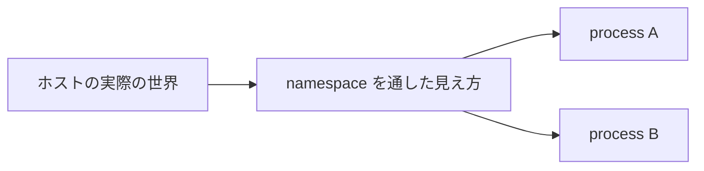

# 第4章: namespace

コンテナの仕組みを学ぶとき、最初に強く印象に残るのが `namespace` です。  
なぜなら、コンテナが「自分だけの世界」を持っているように見える大きな理由が namespace にあるからです。

この章の合言葉は次の一文です。

::: tip この章の核心
namespace = 見える世界を分ける
:::

## この章で先に意味を押さえる単語

- `namespace`: process から見える世界を分離する仕組み
- `PID namespace`: 見える process 一覧と PID の見え方を分ける
- `mount namespace`: 見える mount 構成を分ける
- `network namespace`: 見える NIC, IP, routing を分ける
- `UTS namespace`: hostname の見え方を分ける
- `IPC namespace`: process 間通信資源の見え方を分ける
- `user namespace`: UID, GID, 権限の見え方を分ける
- `cgroup namespace`: 見える cgroup パスを分ける

## なぜ namespace が必要なのか

もし何の分離もなければ、1 台の Linux 上で動くすべての process は、ほぼ同じ世界を見ます。

たとえば:

- 同じ PID 空間
- 同じ hostname
- 同じネットワークインターフェース
- 同じ mount 構成

この状態では、アプリを「別環境っぽく」見せることができません。

Docker コンテナが便利なのは、あるアプリに対して:

- 自分だけの process 一覧
- 自分だけの hostname
- 自分だけの NIC や IP
- 自分だけの mount 構成

を見せられるからです。

それを実現する中心機能が namespace です。

## namespace は「存在そのもの」を分けるのではなく「見え方」を分ける

ここが初学者が最も混乱しやすい点です。

namespace は、何かを完全に別物として新規作成する魔法ではありません。  
多くの場合、「どこまで見えるか」「どう見えるか」を process ごとに変えています。

たとえば PID namespace では:

- ホストには多数の process がいる
- でもコンテナの中の process からは、一部だけが見える
- しかもその中での PID 番号がホストと違って見えることがある

つまり:

- ホスト側の存在が消えるわけではない
- ただしその process から見える世界が制限される

のです。



より具体的には、同じ Linux カーネルの上にいながら、process ごとに「観測窓」を切り替えているイメージです。

## Linux の主な namespace

コンテナ理解で重要な namespace は次の 7 つです。

- PID namespace
- Mount namespace
- Network namespace
- UTS namespace
- IPC namespace
- User namespace
- Cgroup namespace

順に見ていきます。

## PID namespace

`PID namespace` は、process 一覧と PID 番号の見え方を分離します。

### 何がうれしいのか

コンテナ内で `ps aux` を打ったとき、ホスト上の全 process が見えてしまったら「独立した環境っぽさ」がなくなります。

PID namespace を使うと、その namespace 内の process からは、自分たちの process 群だけが見えます。

また、同じ process でも:

- ホストから見た PID
- コンテナ内から見た PID

が異なることがあります。

### PID 1 の意味

PID namespace 内には、その namespace から見た `PID 1` が存在します。  
コンテナの中でアプリが PID 1 になりやすいのはこのためです。

## Mount namespace

`Mount namespace` は、process から見える mount 構成を分離します。

これは「どのファイルシステムが、どこに接続されて見えるか」を process ごとに変えるものです。

コンテナで:

- ホストと違う `/`
- 専用の `/proc`
- 専用の bind mount

などを見せられるのは、mount namespace があるからです。

第5章の `rootfs` や `mount` の話と強くつながります。

## Network namespace

`Network namespace` は、ネットワーク関連の見え方を分離します。

具体的には:

- ネットワークインターフェース
- IP アドレス
- ルーティングテーブル
- ポート空間

などが process ごとに別世界として扱えるようになります。

Docker コンテナの中で `ip addr` を打つと、ホストとは違う `eth0` や loopback が見えることがあります。  
これは network namespace により、その process から見えるネットワーク世界が分離されているからです。

## UTS namespace

`UTS namespace` は、主に `hostname` と `domain name` を分離します。

コンテナごとに別 hostname を持てるのはこのためです。

```bash
hostname
```

の結果がホストとコンテナで違うのは、別カーネルを使っているからではなく、UTS namespace で見え方が切られているからです。

## IPC namespace

`IPC namespace` は Inter-Process Communication のための資源を分離します。

たとえば System V IPC や POSIX message queue などが対象です。

初学者の段階では、まず:

- process 間通信に使う一部資源も namespace で分離できる

と押さえれば十分です。

## User namespace

`User namespace` は、UID/GID や権限の見え方を分離します。

これが入ると:

- コンテナ内では root (UID 0) に見える
- でもホスト側では別の非特権 UID に対応させる

といったことが可能になります。

これは rootless container や権限分離の文脈で重要です。

ただし最初の理解段階では、`capability` や通常の root 制限と混ざりやすいので注意してください。

## Cgroup namespace

`Cgroup namespace` は、process から見える cgroup パスの見え方を分離します。

これは `cgroup` そのものの制限機能というより、「どの cgroup 階層が見えるか」という表示上の分離に近いです。

第6章で扱う `cgroup` は資源制限の仕組みそのものですが、cgroup namespace は「見える cgroup 情報の世界」を切ります。

## Docker コンテナで見え方が変わる理由

Docker コンテナの中で、次のコマンドを打ったとします。

```bash
ps aux
hostname
ip addr
mount | head
```

それぞれが変わる理由は次のとおりです。

| コマンド | 主な理由 |
| --- | --- |
| `ps aux` | PID namespace |
| `hostname` | UTS namespace |
| `ip addr` | Network namespace |
| `mount` | Mount namespace |

ここで重要なのは、Docker が独自にそれらを偽装しているわけではないことです。  
Linux カーネルが namespace に基づいて、その process に見せる情報を変えています。

## `/proc/<pid>/ns` で namespace を観察する

各 process が属している namespace は `/proc/<pid>/ns` に表れます。

たとえば自分の shell なら:

```bash
ls /proc/$$/ns
readlink /proc/$$/ns/pid
readlink /proc/$$/ns/mnt
readlink /proc/$$/ns/net
```

のように確認できます。

出力例:

```text
pid:[4026531836]
mnt:[4026531840]
net:[4026531993]
```

角括弧内の番号は namespace オブジェクトの識別子です。  
同じ番号なら同じ namespace、違う番号なら別 namespace に所属していると考えられます。

## `lsns` は何を見せるか

`lsns` は現在の namespace 一覧を見やすく表示してくれるコマンドです。

```bash
lsns
```

典型的には:

- namespace の種類
- namespace ID
- 所属 process

などが見えます。

`lsns` は util-linux に含まれることが多いですが、最小構成環境では入っていない場合があります。

## 実験: 自分の namespace を見る

### 目的

自分の shell がどんな namespace に所属しているかを観察します。

### 実行コマンド

```bash
lsns | head
readlink /proc/$$/ns/pid
readlink /proc/$$/ns/mnt
readlink /proc/$$/ns/uts
readlink /proc/$$/ns/net
```

### 期待される出力の例

```text
NS TYPE   NPROCS PID USER COMMAND
4026531836 pid      98   1 root /sbin/init
...
pid:[4026531836]
mnt:[4026531840]
uts:[4026531838]
net:[4026531993]
```

### 出力の読み方

- `TYPE` で namespace の種類が分かる
- `readlink` の番号が、その process の属する namespace を示す
- ホストの通常 shell では、他の多くの process と同じ namespace にいることが多い

### 何が理解できるか

- namespace は process ごとに紐付く
- `/proc/<pid>/ns` で観察できる

### 注意点

- 出力される種類や件数は環境に依存します

## 実験: PID namespace を作って `ps` の見え方を変える

### 目的

PID namespace に入ると process 一覧の見え方が変わることを確認します。

### 実行コマンド

```bash
sudo unshare --pid --fork --mount-proc bash
ps aux
echo $$
exit
```

### 期待される出力の例

```text
USER   PID %CPU %MEM    VSZ   RSS TTY   STAT START   TIME COMMAND
root     1  0.0  0.1  ...    ... pts/0 S    12:00   0:00 bash
root     7  0.0  0.1  ...    ... pts/0 R+   12:00   0:00 ps aux
1
```

### 出力の読み方

- 新しい shell がその namespace 内では PID 1 に見える
- `ps aux` で見える process も少なくなる
- ホストの全 process が見えていないことが分かる

### 何が理解できるか

- PID namespace は見える process 世界を分ける
- 同じ Linux カーネル上でも、PID の見え方を変えられる

### 注意点

- `--mount-proc` を付けないと `ps` の見え方が分かりづらいことがあります
- `sudo` が必要です

## 実験: UTS namespace で hostname を変える

### 目的

UTS namespace により hostname の見え方が変わることを確認します。

### 実行コマンド

```bash
hostname
sudo unshare --uts bash
hostname
hostname demo-container
hostname
exit
hostname
```

### 期待される出力の例

```text
ubuntu-host
ubuntu-host
demo-container
ubuntu-host
```

### 出力の読み方

- `unshare --uts` 直後は元の hostname を引き継ぐことが多い
- その namespace 内で変更すると、その shell からは別 hostname に見える
- 抜けるとホスト hostname は変わっていない

### 何が理解できるか

- UTS namespace は hostname の見え方を分ける
- ホスト全体の設定を書き換えたのではなく、別世界側で見え方を変えている

### 注意点

- `sudo` が必要です
- 配布によって hostname コマンドの実装差はあります

## 実験: Mount namespace も別世界になることを先に体験する

### 目的

mount namespace に入ると mount 構成が別扱いになることを体感します。

### 実行コマンド

```bash
mount | head -n 3
sudo unshare --mount bash
mount | head -n 3
exit
```

### 期待される出力の例

```text
overlay on / type overlay ...
proc on /proc type proc ...
tmpfs on /run type tmpfs ...
```

### 出力の読み方

- 見た目は同じに見えることもあります
- 重要なのは「これ以降、この shell の中だけで mount をいじれる土台に入った」ことです
- 実際の mount 操作は第5章で行います

### 何が理解できるか

- namespace は PID だけではなく mount 世界にもある
- process ごとに別のファイルシステム世界を作れる

### 注意点

- この実験だけでは差が見えにくい場合があります
- 実際の差分確認は第5章の mount 実験で行います

## Docker コンテナの namespace を見る

Docker がある環境では、コンテナの PID を取り、その process の namespace を見ると理解が深まります。

```bash
docker run -d --name nsdemo nginx
pid=$(docker inspect --format '{{.State.Pid}}' nsdemo)
readlink /proc/$pid/ns/pid
readlink /proc/$pid/ns/mnt
readlink /proc/$pid/ns/net
docker rm -f nsdemo
```

これにより、ホスト shell とは別 namespace にいることが観察できます。

## よくある誤解

### 誤解1: namespace は完全に別 OS を作る

違います。同じ Linux カーネルを共有したまま、見え方を process ごとに分けています。

### 誤解2: namespace があれば資源制限もできる

違います。namespace は主に「見える世界の分離」です。  
資源制限は cgroup の役割です。

### 誤解3: namespace の種類は 1 つだけで、全部同じことをしている

違います。PID、mount、network、UTS など、それぞれ分ける対象が違います。

## この章で理解すべきこと

- namespace は process から見える世界を分離する仕組みである
- namespace は存在そのものを消すのではなく、見え方を切り替えることが多い
- PID namespace は process 一覧と PID の見え方を分ける
- Mount namespace は mount 構成を分ける
- Network namespace は NIC や IP の見え方を分ける
- UTS namespace は hostname を分ける
- `/proc/<pid>/ns` や `lsns` で namespace を観察できる
- Docker コンテナの `ps`, `hostname`, `ip addr` の違いは namespace による
