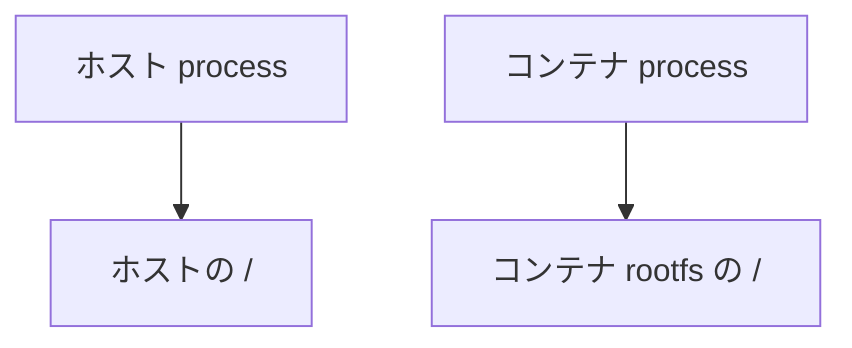
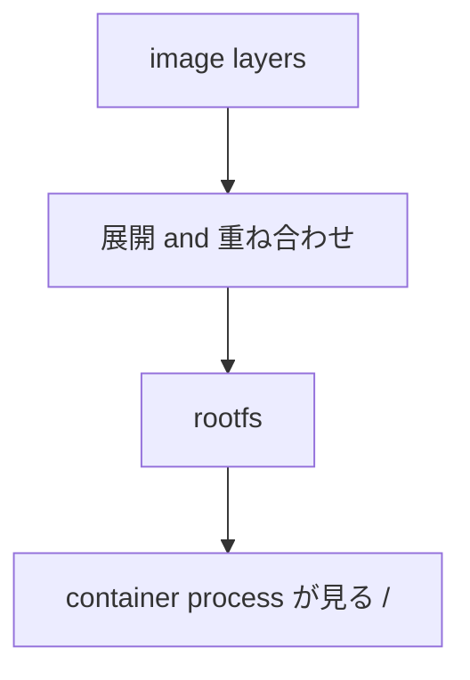
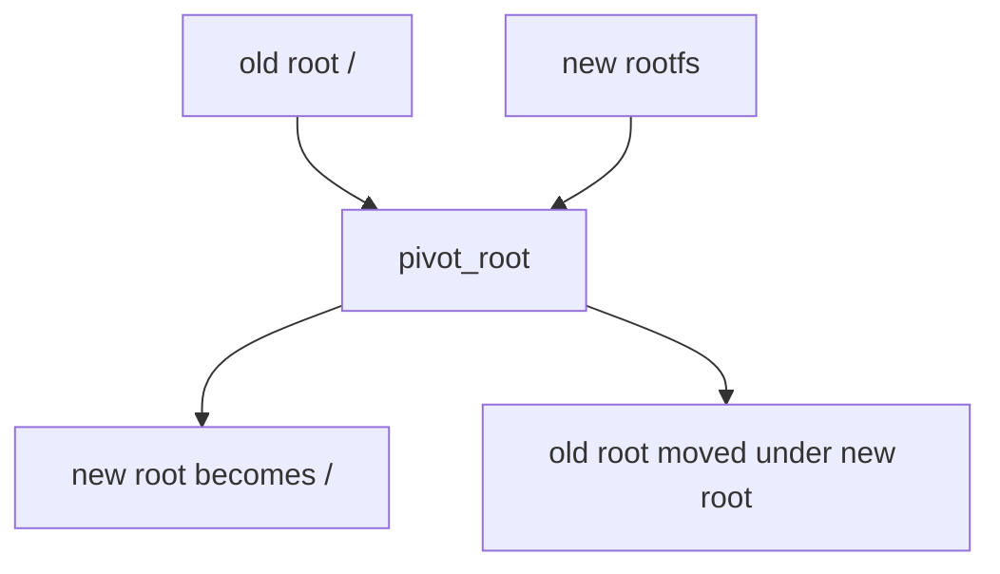

# 第5章: mount / rootfs / chroot / pivot_root

コンテナの中に入ると、`/` の中身がホストと違って見えます。

たとえばホストの `/` にはたくさんのファイルや設定がありますが、コンテナの中ではもっと小さな Linux ユーザーランドだけが見えることがあります。

この章の核心は次の 2 つです。

::: tip この章の核心
rootfs = 見える `/` の中身  
mount = ファイルシステムを特定の場所に接続する
:::

## この章で先に意味を押さえる単語

- `filesystem`: ファイルやディレクトリを保存・管理する仕組み
- `mount`: filesystem やディレクトリをある場所に接続すること
- `rootfs`: process に見せる `/` の中身一式
- `bind mount`: 既存ディレクトリを別の場所にも見せる mount
- `chroot`: process から見た root directory を変える仕組み
- `pivot_root`: rootfs を本格的に切り替える仕組み

そして、`chroot` や `pivot_root` は「その process がどの `/` を根として見るか」を扱うための関連技法です。

## なぜこの章が重要なのか

namespace を学んだだけでは、まだコンテナの「ファイルシステムの別世界感」は十分に説明できません。

たとえば:

- なぜコンテナ内にはホストの `/home` が見えないのか
- なぜコンテナ内に `/bin`, `/etc`, `/usr` が独立して存在するように見えるのか
- なぜ bind mount でホストのディレクトリをコンテナに差し込めるのか

これらは `mount`, `rootfs`, `mount namespace` の組み合わせで説明されます。

## mount とは何か

`mount` は、あるファイルシステムやディレクトリを、あるパスに接続して見えるようにする操作です。

日常的な感覚で言うと:

- ストレージやファイル群を
- ある場所に
- ぶら下げて見えるようにする

操作です。

たとえば `/dev/sdb1` を `/mnt/data` に mount すると、そのデバイス上の内容が `/mnt/data` の下に見えるようになります。

Linux では `/` 自体も 1 つの root filesystem として mount されています。

## `/` は「プロセスから見えるファイルシステムの根」

初学者が見落としやすいのは、`/` は絶対的な物理場所ではなく、「その process から見た根」だという点です。

ホスト上の普通の shell から見た `/` と、コンテナ内 process から見た `/` は同じとは限りません。



この違いを作る中心が mount namespace と rootfs です。

## rootfs とは何か

`rootfs` は、その process に見せたい `/` の中身一式です。

たとえば Ubuntu コンテナイメージを使う場合、最終的には次のようなファイル群が rootfs として使われます。

- `/bin`
- `/usr`
- `/etc`
- `/lib`
- `/tmp`

つまり rootfs は「OS カーネル」ではなく、「ユーザーランドのファイル群」と考えるとよいです。

::: warning よくある誤解
コンテナイメージに Linux カーネルが入っているわけではありません。  
入っているのは主にユーザーランドのファイル群です。
:::

## コンテナイメージから rootfs が用意される

Docker ではイメージがレイヤーとして保存されます。  
そのレイヤーを展開・重ね合わせた結果、コンテナ用 rootfs が組み上がります。

ざっくり言うと:



後で出てくる `overlayfs` などがこの実装に使われることがありますが、この教材ではまず「最終的に rootfs というファイル群ができる」と理解すれば十分です。

## mount namespace と rootfs の関係

`rootfs` だけあっても、その process にそれを見せる仕組みが必要です。  
そこで mount namespace が効いてきます。

mount namespace があると:

- ホストとは別の mount 構成を process に見せられる
- その中で rootfs を `/` として見せられる
- `/proc` や `/dev` なども個別に組める

つまり:

- `rootfs` は見せたい中身
- `mount namespace` はそれを見せる舞台

です。

## chroot は何をするのか

`chroot` は change root の略です。  
ある process から見た root directory を切り替えます。

たとえば:

```bash
sudo chroot /some/rootfs /bin/bash
```

とすると、その shell からは `/some/rootfs` が `/` に見えるようになります。

### chroot のイメージ

```mermaid
flowchart LR
  A[実際のホスト filesystem]
  B[/some/rootfs]
  C[chroot 後の process から見た /]
  A --> B --> C
```

### chroot の限界

`chroot` は歴史的に古く、便利ですが、単独でコンテナ相当の分離になるわけではありません。

理由:

- process 一覧は分離しない
- ネットワークも分離しない
- mount namespace と組み合わせないと見え方が不完全
- root 権限が強いと抜け道の議論が出やすい

なので、`chroot = コンテナ` ではありません。  
ただし「別の `/` を見せる」という発想を理解するには有益です。

## pivot_root は何をするのか

`pivot_root` は、現在の root filesystem を新しい root に切り替え、古い root を別の場所へ退避させる仕組みです。

コンテナ runtime では、より本格的に新しい rootfs へ切り替える際に `pivot_root` が使われることがあります。

### イメージ

もともとの `/` をそのまま捨てるのではなく:

- 新しい root を `/` にする
- 古い root を一時的に別位置に退避する

という動きです。



## chroot と pivot_root の違い

これは重要なので表で整理します。

| 項目 | `chroot` | `pivot_root` |
| --- | --- | --- |
| 何をするか | process から見た root を変える | mount 上の root を本格的に切り替える |
| 主な用途 | 簡易的な root 切替、古典的隔離 | コンテナ runtime の本格的 rootfs 切替 |
| mount との関係 | 単独でも使えるが不十分 | mount 構成と密接 |
| 古い root の扱い | そのまま見えなくする感覚 | 古い root を別位置へ退避できる |

初学者向けには、まず次の理解で十分です。

- `chroot`: 見る根を変える
- `pivot_root`: rootfs を切り替えるための、より本格的なやり方

## Docker コンテナ内の `/` がホストと違う理由

Docker コンテナ内の `/` がホストと違うのは、主に次の流れによります。

1. イメージから rootfs を作る
2. mount namespace を用意する
3. その namespace 内で rootfs を `/` として見せる
4. 必要な mount (`/proc`, `/dev`, bind mount など) を追加する
5. 最後にコンテナ内の process を起動する

結果として、コンテナ内の process は「自分だけの `/`」を見ているように感じます。

## `/proc/<pid>/mounts` も観察窓口になる

各 process から見える mount 一覧は `/proc/<pid>/mounts` でも見られます。

```bash
cat /proc/$$/mounts | head
```

これは「今この process がどんなファイルシステム世界を見ているか」を観察する強力な手段です。

第2章で `/proc` を学んだ意味が、ここでも出てきます。

## 実験: 現在の mount 構成を見る

### 目的

今の shell が見ている mount 世界を確認します。

### 実行コマンド

```bash
mount | head
findmnt | head
cat /proc/$$/mounts | head
```

### 期待される出力の例

```text
proc on /proc type proc (rw,nosuid,nodev,noexec,relatime)
sysfs on /sys type sysfs (rw,nosuid,nodev,noexec,relatime)
tmpfs on /run type tmpfs (rw,nosuid,nodev,relatime,size=...)
```

### 出力の読み方

- どの filesystem が
- どこに mount されているか
- どんな type か

を見ます。

### 何が理解できるか

- Linux の `/` は多数の mount から成り立っている
- process は mount 構成を通じて filesystem 世界を見る

### 注意点

- 出力は環境や仮想化基盤によりかなり異なります

## 実験: mount namespace の中だけで mount を追加する

### 目的

mount namespace を分けると、その中だけで別の mount 構成を作れることを確認します。

### 実行コマンド

```bash
mkdir -p /tmp/mnt-demo/source /tmp/mnt-demo/target
echo hello >/tmp/mnt-demo/source/hello.txt
sudo unshare --mount bash
mount --make-rprivate /
mount --bind /tmp/mnt-demo/source /tmp/mnt-demo/target
ls /tmp/mnt-demo/target
cat /tmp/mnt-demo/target/hello.txt
exit
ls /tmp/mnt-demo/target
```

### 期待される出力の例

```text
hello.txt
hello
```

終了後の外側では:

```text
# 空、または bind mount が存在しない
```

### 出力の読み方

- namespace の中では `target` に `source` が重なって見える
- 外に戻ると、その mount は見えない

### 何が理解できるか

- mount namespace は mount の見え方を分ける
- process ごとに別の filesystem 世界を作れる

### 注意点

- 実験後に shell を抜けること
- `mount --make-rprivate /` を先に実行し、mount 変更の伝播を止めてから実験すること
- `/tmp` 配下で完結する安全寄りの実験だが、`sudo` 付き mount 操作なので手順は省略しないこと

## 実験: `chroot` の感覚を安全に体験する

### 目的

`chroot` が「別の `/` を見せる」発想であることを体験します。

### 実行コマンド

```bash
mkdir -p /tmp/chroot-demo/bin
cp /bin/sh /tmp/chroot-demo/bin/
ldd /bin/sh
```

まずここで「共有ライブラリも必要になる」ことを観察します。  
実際の `chroot` 実行は、最小 rootfs を正しく作らないと失敗しやすいため、ここでは概念確認に留めます。

### 期待される出力の例

```text
linux-vdso.so.1 (...)
libc.so.6 => /lib/x86_64-linux-gnu/libc.so.6 (...)
```

### 出力の読み方

- `/bin/sh` 単体では動かず、依存ライブラリが必要
- rootfs とは「コマンド本体だけ」でなく、周辺ファイルも揃った filesystem である

### 何が理解できるか

- rootfs は単なる 1 ファイルではない
- `chroot` を成立させるには、それなりに整った filesystem 群が必要

### 注意点

- 実際に `chroot` を深追いすると依存解決が必要になるため、ここでは概念実験に留める

## 実験: Docker コンテナの rootfs 感覚を見る

### 目的

コンテナの中から見える `/` がホストと違うことを確認します。

### 実行コマンド

```bash
ls /
docker run --rm ubuntu ls /
```

### 期待される出力の例

```text
Applications  Users  bin  etc ...
bin
boot
dev
etc
home
lib
proc
root
tmp
usr
var
```

### 出力の読み方

- ホストの `/` と、コンテナの `/` の中身が違う
- コンテナは自分用 rootfs を見ている

### 何が理解できるか

- コンテナ内の `/` はホストの `/` そのものではない
- rootfs の考え方が Docker の見た目につながる

### 注意点

- ホスト OS によって `/` の見え方は大きく異なります

## よくある誤解

### 誤解1: `mount` はディスクをつなぐ操作だけである

もっと一般的です。bind mount のように、既存ディレクトリを別位置へ見せることもできます。

### 誤解2: `chroot` できればコンテナと同じ

違います。`chroot` は root 切替の一部にすぎず、namespace や cgroup、権限制御がありません。

### 誤解3: コンテナ内の `/` はホストの `/` をそのまま隠しているだけ

実際には rootfs、mount namespace、追加 mount などを組み合わせた結果として見えています。

## この章で理解すべきこと

- mount はファイルシステムを特定の場所に接続する仕組みである
- rootfs は process から見える `/` の中身である
- コンテナイメージから rootfs が用意される
- mount namespace と組み合わせることで、process ごとに異なる `/` を見せられる
- `chroot` は root の見え方を変える
- `pivot_root` は rootfs を本格的に切り替えるための仕組みである
- Docker コンテナ内の `/` がホストと違うのは、rootfs と mount の仕組みによる
