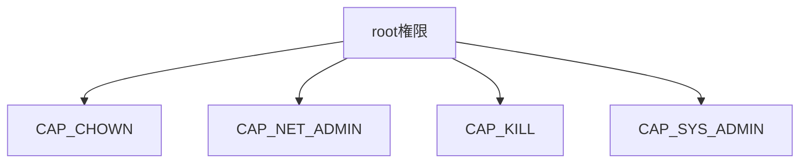

# 第7章: capability

ここまでで、コンテナは:

- namespace で見える世界を分け
- cgroup で使える資源を制限し
- rootfs と mount で見える `/` を作る

ことが分かってきました。

しかし、それでもまだ問題があります。  
それは `root` 権限です。

Linux の root は非常に強力です。  
もしコンテナ内 root が、ホスト root とほぼ同じ強さを持っていたら危険です。

そこで重要になるのが `capability` です。

::: tip この章の核心
capability = root 権限を細かく分ける
:::

## この章で先に意味を押さえる単語

- `root ユーザー`: Linux の強い管理者権限を持つユーザー
- `privilege`: 何ができるかを決める権限
- `capability`: root 権限を小さな能力へ分割したもの
- `CAP_SYS_ADMIN`: 非常に広く強い capability
- `CAP_NET_ADMIN`: ネットワーク設定に関わる capability

## なぜ capability が必要なのか

昔ながらの UNIX 的な発想では、権限は大ざっぱに次の 2 択でした。

- root
- root 以外

しかし実際には、権限はもっと細かく分けたいことが多いです。

たとえば:

- ファイル所有者を変えたい
- ネットワーク設定だけ触りたい
- mount だけ許したい
- 他 process へ signal を送りたい

これらを全部 root にまとめると、強すぎます。

Linux capability は、こうした root 権限を小さな部品に分解する仕組みです。

## capability の基本イメージ

従来:

- root は全部できる

capability 導入後:

- root 相当権限を細かい能力集合として持つ
- process ごとに、その一部だけを有効にできる



## 代表的な capability

### `CAP_CHOWN`

ファイル所有者変更に関わる能力です。

### `CAP_KILL`

他 process へ signal を送る権限に関わります。

### `CAP_NET_ADMIN`

ネットワーク設定に関わる強い能力です。  
インターフェース設定や routing の変更などに関与します。

### `CAP_SYS_ADMIN`

非常に広く、強い capability です。  
しばしば「何でも屋」に近く、コンテナ文脈では危険度が高いとされます。

初学者向けには、`CAP_SYS_ADMIN` を「かなり危険で広すぎる能力」と理解してください。

## コンテナで root に見えても、ホストの完全な root と同じではない

これはコンテナ理解でとても重要です。

コンテナ内で:

```bash
id
```

を打つと、`uid=0(root)` と出ることがあります。

しかし、それは「ホストの完全な root と同じ権限を持つ」という意味ではありません。

なぜなら:

- capability が落とされていることがある
- user namespace が使われていることがある
- seccomp で syscall が制限されていることがある

からです。

つまりコンテナ内 root は、見かけ上 root でも、実際には「かなり絞られた root」である場合があります。

## capability と user namespace の違い

混同しやすいので分けます。

- `capability`: 何ができるかを細かく分割する
- `user namespace`: UID/GID や権限の見え方を分離する

両者は関連しますが、同じものではありません。

## `/proc/<pid>/status` の `CapEff` など

process の capability 状態は `/proc/<pid>/status` で見られます。

```bash
cat /proc/$$/status | grep Cap
```

典型的には次のような項目が出ます。

- `CapInh`
- `CapPrm`
- `CapEff`
- `CapBnd`
- `CapAmb`

初学者向けには、まず `CapEff` を「今その process が有効に使える capability 群」と見てよいです。

## `capsh` と `getpcaps`

より分かりやすく見るには、次のツールが役立ちます。

```bash
capsh --print
getpcaps $$
```

入っていない場合は、たとえば以下が必要です。

```bash
sudo apt update
sudo apt install libcap2-bin
```

## Docker の `--cap-add`, `--cap-drop`, `--privileged`

Docker は capability を調整できます。

### `--cap-drop`

特定の capability を落とします。

```bash
docker run --cap-drop=NET_RAW ...
```

### `--cap-add`

必要な capability を追加します。

```bash
docker run --cap-add=NET_ADMIN ...
```

### `--privileged`

かなり広い権限を与える危険なオプションです。  
学習用以外では安易に使わないのが基本です。

::: danger 注意
`--privileged` は「コンテナに強い権限を与えすぎる」方向です。  
トラブルシュートで雑に使う癖を付けると、コンテナの隔離前提を壊しやすくなります。
:::

## 実験: 自分の shell の capability を見る

### 目的

process が capability 集合を持っていることを確認します。

### 実行コマンド

```bash
cat /proc/$$/status | grep Cap
capsh --print
getpcaps $$
```

### 期待される出力の例

```text
CapInh: 0000000000000000
CapPrm: 00000000a80425fb
CapEff: 00000000a80425fb
CapBnd: 00000000a80425fb
...
Capabilities for `18452': cap_chown,cap_dac_override,cap_fowner,...
```

### 出力の読み方

- 16 進数表現で capability ビット集合が見える
- `capsh` や `getpcaps` を使うと人間向けに読みやすくなる

### 何が理解できるか

- root 権限は 1 枚岩ではなく、細かい能力集合として表現される
- process ごとに capability 状態を観察できる

### 注意点

- `capsh` や `getpcaps` が無い場合は `libcap2-bin` を入れてください

## 実験: Docker コンテナの capability を見る

### 目的

コンテナ内 root が、ホスト root と同じとは限らないことを確認します。

### 実行コマンド

```bash
docker run --rm ubuntu bash -lc 'id && cat /proc/self/status | grep Cap'
```

さらに比較例:

```bash
docker run --rm --cap-drop=ALL ubuntu bash -lc 'cat /proc/self/status | grep Cap'
```

### 期待される出力の例

```text
uid=0(root) gid=0(root) groups=0(root)
CapPrm: 00000000a80425fb
CapEff: 00000000a80425fb

CapPrm: 0000000000000000
CapEff: 0000000000000000
```

### 出力の読み方

- 1 つ目は root に見え、いくつかの capability が残っている
- 2 つ目は `--cap-drop=ALL` により capability がほぼ空になる

### 何が理解できるか

- コンテナ内 root の強さは調整可能
- `uid=0` と「何でもできる」は同義ではない

### 注意点

- イメージや Docker 設定により細部は異なります

## 実験: `CAP_NET_ADMIN` が必要な操作の感覚を知る

### 目的

ネットワーク管理系操作が一般には強い capability を必要とすることを知ります。

### 実行コマンド

```bash
docker run --rm debian:bookworm-slim bash -lc 'apt-get update >/dev/null && apt-get install -y iproute2 >/dev/null && ip link'
docker run --rm debian:bookworm-slim bash -lc 'apt-get update >/dev/null && apt-get install -y iproute2 >/dev/null && ip link set lo down'
```

### 期待される出力の例

```text
RTNETLINK answers: Operation not permitted
```

### 出力の読み方

- 情報を見るだけならできても、設定変更は拒否されることがある
- これは capability が削られている影響の一例です

### 何が理解できるか

- capability は「何ができるか」に直結する
- コンテナでは危険な能力が既定で落とされることが多い

### 注意点

- `ip` コマンドが入っていないイメージが多いため、この例ではその場で `iproute2` を入れている
- パッケージ取得のためネットワーク接続が必要

## よくある誤解

### 誤解1: root なら何でもできる

現代 Linux では capability、namespace、seccomp などにより、見かけの root が制限されることがあります。

### 誤解2: capability は namespace の一種である

違います。namespace は見える世界、capability は権限の分割です。

### 誤解3: `--privileged` は便利な解決策である

短期的には便利でも、隔離の前提を壊すので常用すべきではありません。

## この章で理解すべきこと

- Linux の root は強すぎるため、capability で細かく分割されている
- `CAP_SYS_ADMIN`, `CAP_NET_ADMIN`, `CAP_CHOWN`, `CAP_KILL` などがある
- コンテナ内で root に見えても、ホストの完全な root と同じとは限らない
- `/proc/<pid>/status`, `capsh`, `getpcaps` で capability を観察できる
- Docker の `--cap-add`, `--cap-drop`, `--privileged` は capability 調整と深く関係する
