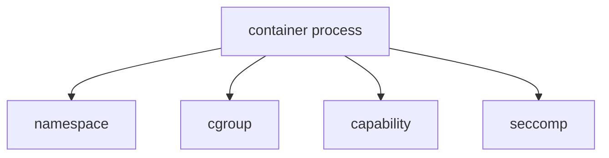

# 第8章: seccomp

namespace は見える世界を分けました。  
cgroup は使える資源を制限しました。  
capability は root 権限を細かく分けました。

それでも、まだ process は多くの syscall を呼べます。  
そこで最後の守りとして重要になるのが `seccomp` です。

::: tip この章の核心
seccomp = 使える syscall を制限する
:::

## この章で先に意味を押さえる単語

- `syscall`: process が kernel に仕事を頼む入口
- `seccomp`: 使える syscall を制限する仕組み
- `filter`: 許可・拒否ルール
- `seccomp profile`: syscall ルールをまとめた設定
- `attack surface`: 攻撃に利用され得る入口の広さ

## なぜ seccomp が必要なのか

process はカーネルに仕事を頼むとき、syscall を使います。  
逆に言えば、危険な syscall を多く許したままだと、攻撃面が広くなります。

コンテナでは特に:

- コンテナ脱出の足がかりを減らしたい
- 普通のアプリに不要な低レベル syscall を使わせたくない
- バグや悪用の影響範囲を狭めたい

という目的があります。

そこで seccomp により、「この process は、この syscall なら許可」「これは拒否」といった制御を行います。

## seccomp とは何か

`seccomp` は secure computing mode の略です。  
Linux で syscall フィルタリングを行う仕組みとして使われます。

コンテナ文脈では、主に:

- 危険または不要な syscall を拒否する
- プロファイルに基づいて許可リスト / 拒否リストを適用する

という使い方をします。

## namespace や cgroup との違い

ここも表で整理します。

| 仕組み | 主な役割 |
| --- | --- |
| namespace | 見える世界を分ける |
| cgroup | 使える資源を制限する |
| capability | root 権限を細かく分ける |
| seccomp | 使える syscall を制限する |

つまり seccomp は、「見えるもの」でも「使える量」でもなく、「呼べるカーネル機能」を絞る仕組みです。

## seccomp はどんな syscall を止めるのか

具体的なプロファイル次第ですが、コンテナで不要または危険度が高い syscall を止めることがあります。

初学者向けには、まず:

- アプリに不要な低レベル機能を閉じる
- 万一侵入されても、使えるカーネル入口を減らす

という理解で十分です。

## Docker のデフォルト seccomp profile

Docker は、デフォルトで seccomp profile を適用します。

つまり Docker コンテナは通常、完全に素の Linux process よりも「呼べる syscall が減っている」状態です。

利用者が明示的に:

- 独自 seccomp profile を指定する
- seccomp を無効化する

こともできますが、まずは「デフォルトで防御が入っている」と考えてよいです。

## `/proc/<pid>/status` の `Seccomp`

seccomp 状態は次で観察できます。

```bash
cat /proc/$$/status | grep Seccomp
```

たとえば:

```text
Seccomp:        2
Seccomp_filters: 1
```

のような出力が見えることがあります。

初学者向けには:

- `0`: 無効
- `2`: フィルタリングあり

くらいをまず押さえれば十分です。

## capability と seccomp の違い

似て見えることがあるので区別しましょう。

- `capability`: ある種の強い操作権限を持つか
- `seccomp`: その syscall 自体を呼べるか

たとえば:

- capability があっても seccomp に止められることがある
- seccomp が許していても capability が足りず失敗することがある

つまり両者は別の層の防御です。

## 実験: 自分の shell の seccomp 状態を見る

### 目的

現在の process に seccomp が適用されているかを確認します。

### 実行コマンド

```bash
cat /proc/$$/status | grep Seccomp
```

### 期待される出力の例

```text
Seccomp:        0
Seccomp_filters: 0
```

または環境によって:

```text
Seccomp:        2
Seccomp_filters: 1
```

### 出力の読み方

- `0` なら seccomp 無効
- `2` なら何らかのフィルタリングが有効

### 何が理解できるか

- seccomp は process ごとの状態として観察できる
- 環境によっては shell 自体にも seccomp が入ることがある

### 注意点

- Docker 内、systemd サービス内、CI 上などで結果が変わることがあります

## 実験: Docker コンテナで seccomp 状態を見る

### 目的

Docker コンテナで seccomp が有効になっていることを観察します。

### 実行コマンド

```bash
docker run --rm ubuntu bash -lc 'cat /proc/self/status | grep Seccomp'
```

### 期待される出力の例

```text
Seccomp:        2
Seccomp_filters: 1
```

### 出力の読み方

- Docker のデフォルト seccomp profile により、フィルタリングが有効であることが多い

### 何が理解できるか

- Docker は namespace や cgroup だけでなく seccomp も使う

### 注意点

- コンテナランタイム設定や rootless 環境で差が出ることがあります

## 実験: seccomp を外した場合との比較

### 目的

seccomp 状態の差分を観察します。

### 実行コマンド

```bash
docker run --rm --security-opt seccomp=unconfined ubuntu bash -lc 'cat /proc/self/status | grep Seccomp'
```

### 期待される出力の例

```text
Seccomp:        0
Seccomp_filters: 0
```

### 出力の読み方

- `unconfined` にすると seccomp が無効になった状態を観察できる

### 何が理解できるか

- seccomp は Docker による追加保護層である
- 有効/無効で process の状態が変わる

### 注意点

- 学習用実験以外で無効化を常用しないこと

## seccomp は「保険」のような最後の壁

コンテナ保護を層で見ると、次のように考えると分かりやすいです。



- namespace: 世界を分ける
- cgroup: 資源を絞る
- capability: 権限を絞る
- seccomp: syscall 入口を絞る

seccomp は、特に「その process がカーネルに何を頼めるか」を最後に絞る層です。

## よくある誤解

### 誤解1: seccomp は root を一般ユーザーに変える仕組みである

違います。権限そのものではなく、syscall 呼び出しを制御します。

### 誤解2: seccomp があれば namespace は不要

役割が違います。seccomp だけでは process 一覧やネットワークの見え方は分かれません。

### 誤解3: Docker の安全性は seccomp だけで成り立っている

違います。namespace、cgroup、capability などとの組み合わせです。

## この章で理解すべきこと

- seccomp は使える syscall を制限する仕組みである
- namespace や cgroup と違い、できる操作そのものを絞る
- コンテナ脱出や攻撃面の縮小に役立つ
- Docker はデフォルト seccomp profile を使う
- `/proc/<pid>/status` の `Seccomp` で状態を観察できる
