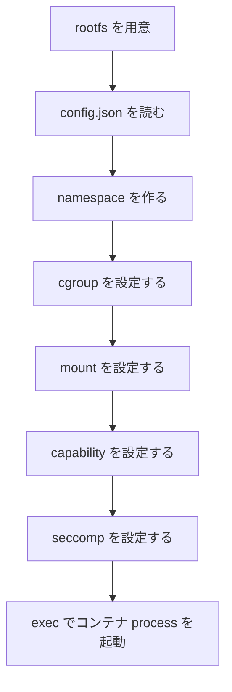
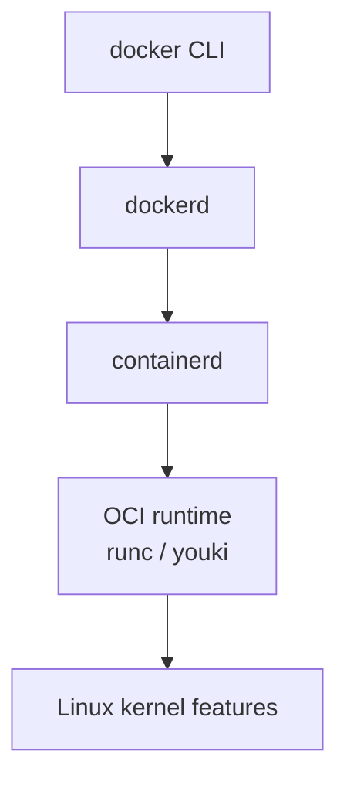

# 第9章: OCI runtime / runc / youki

ここまでで、コンテナを構成する Linux の部品を一通り見てきました。

- process
- syscall
- namespace
- cgroup
- rootfs
- mount
- capability
- seccomp

この章では、これらの部品を「誰が組み合わせてコンテナを起動しているのか」を整理します。

その主役が `OCI runtime` です。

## この章で先に意味を押さえる単語

- `OCI`: Open Container Initiative。コンテナの標準仕様を定める取り組み
- `runtime`: 実際に process を起動・設定する実行役
- `OCI runtime`: Linux 機能を組み合わせてコンテナ process を起動する runtime
- `bundle`: `config.json` と `rootfs` を含む runtime 入力ディレクトリ
- `containerd`: Docker と runtime の間でコンテナ管理を担う中間レイヤー
- `pod`: Kubernetes で 1 つ以上のコンテナをまとめる単位。この教材の中心は container であり pod ではない

## Docker が全部やっているわけではない

Docker を使っていると、つい「Docker がコンテナを作っている」と思いがちです。  
もちろん利用者体験としてはその通りです。

しかし内部レイヤーを分けると、話はもう少し細かくなります。

ざっくり言えば:

- Docker: 利用者向けの高レベル操作
- containerd: コンテナ管理の中間レイヤー
- OCI runtime: 実際に Linux 機能を使って process を起動する低レイヤー

という役割分担になります。

## OCI とは何か

`OCI` は Open Container Initiative の略です。  
コンテナの形式や runtime の振る舞いを標準化する取り組みです。

ここで大事なのは「Docker 独自仕様だけで閉じていない」という点です。

OCI により:

- イメージの形式
- runtime が従うべき仕様

などを共通化し、複数実装が相互運用しやすくなっています。

## OCI runtime spec とは何か

`OCI runtime spec` は、「コンテナ runtime は、どんな設定を受け取り、どのように process を起動するか」を定義する仕様です。

この仕様では、たとえば:

- rootfs の場所
- process の起動コマンド
- namespace 設定
- mount 設定
- capability 設定
- seccomp 設定
- cgroup 関連設定

などを `config.json` の形で表します。

つまり OCI runtime spec は、Linux 機能の組み合わせ方を標準的に表現する約束事です。

## OCI bundle とは何か

OCI runtime が読む入力は、しばしば `bundle` と呼ばれます。

典型的には:

- `config.json`
- `rootfs/`

を含むディレクトリです。

```text
bundle/
├── config.json
└── rootfs/
    ├── bin/
    ├── etc/
    ├── lib/
    └── usr/
```

### `rootfs`

コンテナに見せる `/` の中身です。

### `config.json`

この rootfs をどう使い、どの process をどんな制限で起動するかを書いた設定です。

## `runc` とは何か

`runc` は OCI runtime spec を実装した、非常に有名な runtime です。  
多くのコンテナ基盤で事実上の標準実装として使われています。

利用者は普段 `docker run` を叩いていて `runc` を直接意識しないことも多いですが、低レイヤーでは `runc` のような runtime が Linux 機能を具体的に呼び出しています。

## `youki` とは何か

`youki` も OCI runtime の実装です。  
Rust で書かれている点が特徴です。

重要なのは、「コンテナ runtime の実装は 1 つではない」ことです。

つまり:

- 仕様: OCI runtime spec
- 実装例: `runc`, `youki`

という関係です。

## runtime が大まかに何をするか

runtime の仕事を一言で言えば:

「`config.json` に書かれた通りに、Linux 機能を組み合わせて、コンテナ process を起動する」

ことです。

流れを順に見ます。

## 1. rootfs を用意する

まずコンテナに見せる filesystem の根を用意します。

- イメージレイヤーを展開する
- 必要なら overlay などで組み立てる
- 最終的に `rootfs/` として見せられる状態にする

## 2. OCI `config.json` を読む

次に runtime は `config.json` を読みます。

ここには、たとえば次のような情報が入ります。

- どの process を起動するか
- 環境変数
- mount 一覧
- namespace 設定
- capability 設定
- seccomp profile

## 3. namespace を作る

必要に応じて:

- PID namespace
- mount namespace
- network namespace
- UTS namespace

などを作り、これから起動する process の見える世界を分けます。

## 4. cgroup を設定する

次に、その process 群が使える:

- CPU
- memory
- pids

などの上限を cgroup で設定します。

## 5. mount を設定する

新しい mount namespace の中で:

- rootfs を `/` として扱えるようにする
- `/proc`, `/dev`, `/sys` など必要な mount を作る
- bind mount や read-only mount を設定する

といった処理を行います。

## 6. capability を設定する

コンテナ process が持つ capability を落としたり追加したりして、必要最小限の権限に絞ります。

## 7. seccomp profile を設定する

必要な seccomp フィルタを適用し、不要または危険な syscall を制限します。

## 8. コンテナ内の process を `exec` する

最後に、指定されたコマンドへ `exec` して、コンテナ内のメイン process を起動します。



## Docker / containerd / OCI runtime の関係

非常にざっくりした関係図を描くと次のようになります。



ここで大切なのは、低レイヤーに降りるほど「Linux 機能の組み合わせ」に近づくことです。

## `runc` / `youki` を読むと何が分かるのか

これらの runtime を読むと、抽象概念だった:

- namespace
- cgroup
- mount
- pivot_root
- capability
- seccomp

が、実際にどの順番で、どの syscall や設定で適用されるかが見えてきます。

つまり「コンテナの仕組み」をコードに落とした姿が runtime 実装です。

## 実験: Docker コンテナ process の情報をホストから追う

### 目的

Docker が起動したコンテナ process を、ホスト上の process として観察し、runtime が Linux 機能を組み合わせた結果を逆算します。

### 実行コマンド

```bash
docker run -d --name oci-demo nginx
pid=$(docker inspect --format '{{.State.Pid}}' oci-demo)
echo "$pid"
cat /proc/$pid/status | head
readlink /proc/$pid/ns/pid
readlink /proc/$pid/ns/mnt
cat /proc/$pid/cgroup
cat /proc/$pid/status | grep Cap
cat /proc/$pid/status | grep Seccomp
docker rm -f oci-demo
```

### 期待される出力の例

```text
25180
Name:   nginx
Pid:    25180
...
pid:[4026532981]
mnt:[4026532982]
0::/system.slice/docker-....scope
CapEff: 00000000a80425fb
Seccomp:        2
```

### 出力の読み方

- `ns/*`: namespace にいる
- `cgroup`: cgroup 配下で管理されている
- `CapEff`: capability が調整されている
- `Seccomp`: seccomp が有効

### 何が理解できるか

- Docker コンテナは 1 個の魔法的存在ではなく、複数の Linux 機能をまとった process である
- OCI runtime の仕事が観察結果と結び付く

### 注意点

- Docker / containerd の設定によって cgroup パスや capability 値は異なります

## 実験: `docker inspect` から runtime 的情報を読む

### 目的

高レベルな Docker 情報から、低レイヤー設定を連想できるようにします。

### 実行コマンド

```bash
docker run -d --name inspect-demo --memory=128m --cpus=0.5 nginx
docker inspect inspect-demo
docker rm -f inspect-demo
```

### 期待される出力の例

```text
"Pid": 25210,
"Memory": 134217728,
"NanoCpus": 500000000,
...
```

### 出力の読み方

- `Pid` は実際の Linux process
- `Memory` や `NanoCpus` は cgroup 系制御につながる
- この裏で runtime が Linux 設定を作っている

### 何が理解できるか

- Docker の高レベル指定は、低レイヤーの Linux 機能に変換される

### 注意点

- 出力は長いので、必要なら `jq` で整形してください

## よくある誤解

### 誤解1: OCI runtime は別のコンテナ OS である

違います。Linux 機能を使って process を起動する user space プログラムです。

### 誤解2: `runc` と `youki` は Docker の代替フロントエンドである

違います。どちらも低レイヤー runtime 実装です。

### 誤解3: コンテナの仕組みを学ぶには Docker だけ見ればよい

Docker だけだと抽象度が高く、Linux の本質が見えません。  
低レイヤーでは OCI runtime が Linux 機能を束ねています。

## この章で理解すべきこと

- Docker / containerd / OCI runtime は役割分担している
- OCI runtime spec は、コンテナ起動方法を表現する標準仕様である
- `runc` と `youki` は OCI runtime の実装である
- OCI bundle は `config.json` と `rootfs` を中心に構成される
- runtime は rootfs、namespace、cgroup、mount、capability、seccomp を設定し、最後に `exec` で process を起動する
