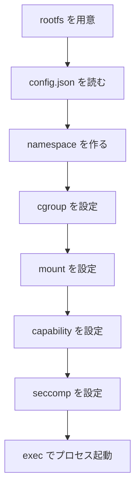

# 第9章: OCI runtime / runc / youki

::: warning 準備中
この章では、Docker と OCI runtime の役割分担を Linux 機能の組み合わせとして整理します。
:::

## Docker / containerd / OCI runtime の関係

## OCI runtime spec とは何か

## `runc` とは何か

## `youki` とは何か

## bundle / `config.json` / `rootfs`

## 起動フロー

## この章で理解すべきこと

- OCI runtime が Linux 機能を束ねてコンテナを起動すること
- `runc` と `youki` はその実装例であること
