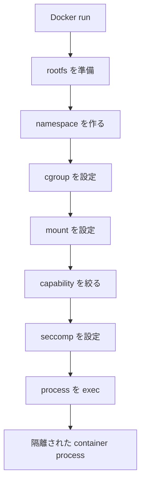

# 第10章: 全体まとめ

ここまで読んだら、コンテナを「Docker の操作対象」ではなく、「Linux の複数機能を組み合わせた process」として見られるようになっているはずです。

最後に、各概念の役割を 1 枚の表で整理します。

## 最重要対比

- namespace = 見える世界を分ける
- cgroup = 使える資源を制限する
- rootfs = 見える `/` の中身
- mount = ファイルシステムを特定の場所に接続する
- capability = root 権限を細かく分ける
- seccomp = 使える syscall を制限する
- container = Linux の機能で隔離されたプロセス
- VM = 別の OS カーネルを起動する仮想マシン

## 対応関係の整理

| 概念 | 一言で言うと何か | 何を解決する仕組みか | Docker/コンテナではどこで使われるか | 観察できるコマンド | 初学者が間違えやすいポイント |
| --- | --- | --- | --- | --- | --- |
| process | 実行中のプログラム | プログラムを実行単位として扱う | コンテナの正体そのもの | `ps aux`, `pstree`, `echo $$` | コンテナは process の外側にある特別な存在だと思いがち |
| syscall | user space から kernel への入口 | アプリがカーネル機能を安全に使う | runtime が namespace, mount, exec などを行う | `strace ls`, `strace -e clone,execve ...` | 高レベル API と syscall の違いが曖昧になりやすい |
| namespace | 見える世界を分ける | process ごとに PID, mount, net などの見え方を変える | コンテナ内の `ps`, `hostname`, `ip addr` がホストと違って見える | `lsns`, `readlink /proc/$$/ns/*` | 資源制限まで namespace がやると思いがち |
| cgroup | process 群の資源制御 | CPU, memory, pids, io を制限・計測する | `--memory`, `--cpus`, `--pids-limit` など | `cat /proc/self/cgroup`, `ls /sys/fs/cgroup`, `systemd-cgls` | namespace と役割を混同しやすい |
| rootfs | 見える `/` の中身 | process ごとに別のユーザーランドを見せる | イメージから展開されたファイル群がコンテナの `/` になる | `docker run --rm ubuntu ls /` | カーネルまでイメージに入っていると思いがち |
| mount | filesystem をつなぐ | rootfs, bind mount, `/proc` などを配置する | コンテナ用の `/`, `/proc`, volume の構成 | `mount`, `findmnt`, `cat /proc/$$/mounts` | ディスク接続だけの話だと思いがち |
| capability | root 権限の分割 | 強すぎる root を細かい能力へ分ける | コンテナ内 root の権限を削る、`--cap-add`, `--cap-drop` | `cat /proc/$$/status | grep Cap`, `capsh --print` | `uid=0` なら無制限だと思いがち |
| seccomp | syscall フィルタ | 危険/不要な syscall を止める | Docker デフォルト seccomp profile | `cat /proc/$$/status | grep Seccomp` | capability と同じ層の制御だと思いがち |
| OCI runtime | Linux 機能を束ねてコンテナを起動する実行役 | 設定に従って namespace, cgroup, mount などを組み合わせる | `runc`, `youki` などが実際に process を起動する | `docker inspect`, `/proc/<pid>/ns`, `/proc/<pid>/cgroup` | Docker 自身が全部直接やっていると思いがち |

## 1 本の流れとして見る

ここまでの話を 1 本の流れでまとめると、Docker によるコンテナ起動は次のように見えます。

## コンテナと VM の違いを最後にもう一度

| 項目 | コンテナ | VM |
| --- | --- | --- |
| カーネル | ホストと共有 | ゲスト OS ごとに持つ |
| 起動単位 | 隔離された process | 仮想ハードウェア上の OS |
| 軽さ | 比較的軽い | 一般に重い |
| 分離の中心 | namespace, cgroup, rootfs, capability, seccomp | ハイパーバイザと別カーネル |

## 学習者が最後に言えるようになってほしいこと

- コンテナは VM ではなく、Linux の機能で隔離された process である
- namespace は見える世界を分ける
- cgroup は使える資源を制限する
- rootfs と mount により、process ごとに別の `/` を見せられる
- capability は root 権限を細かく分ける
- seccomp は使える syscall を制限する
- Docker / OCI runtime は、これらを組み合わせてコンテナを起動している

## この章で理解すべきこと

- 各概念の役割の違い
- それらが Docker の裏側でどう組み合わさるか
- コンテナを Linux 機能の組み合わせとして説明できること
