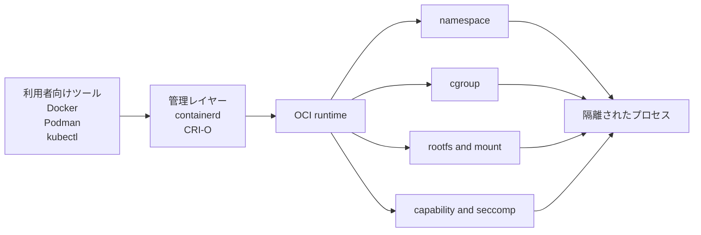

# Linux コンテナの仕組み

Docker を使ったことはあるが中身は曖昧、という読者向けに、container 技術全体の見取り図と、その土台になる Linux の仕組みをつなげて理解する教材です。

## 注意

これは主に作者自身の学習のために作っている教材です。内容の正確性を保証するものではないため、学習の参考資料のひとつとして使ってください。

## この教材で扱うこと

- container 技術の全体像
- container 技術が必要になった背景と、何を解決するのか
- Docker / containerd / CRI-O / OCI runtime の役割の違い
- CRI と OCI の違い
- process
- syscall
- user space / kernel space
- namespace
- cgroup / cgroup v2
- rootfs
- mount
- chroot
- pivot_root
- capability
- seccomp
- procfs
- sysfs
- OCI runtime
- runc / youki
- Docker がコンテナを起動する裏側の流れ

## 想定読者

- Linux 初学者
- プログラミング経験はある
- Docker は触ったことがある
- OCI runtime や `runc` / `youki` に興味がある
- Kubernetes や CRI の位置づけも整理したい

## 学習ゴール

- container 技術全体の中で Docker や OCI runtime がどの位置にいるかを説明できる
- container 技術がなぜ必要になったか、何ができるかを説明できる
- コンテナは VM ではなく、Linux の機能で隔離されたプロセスだと説明できる
- namespace が見える世界を分ける仕組みだと説明できる
- cgroup が使える資源を制限・計測する仕組みだと説明できる
- OCI runtime が Linux 機能をどう組み合わせるかを説明できる

## 読み方

1. まず [第0章: コンテナ技術の全体像](/container-internals/00-container-technology-overview) で地図をつかむ
2. 第1章から第8章で Linux 側の根幹を理解する
3. 単語で引っかかったら [用語ガイド](/container-internals/glossary) をその都度引く
4. 第9章で OCI runtime 層を整理する
5. 第10章で全体の対応関係をまとめる
6. 確認問題とミニプロジェクトで定着させる

Linux 自体にまだほとんど触れていない場合は、最初に用語ガイドへざっと目を通してから本文に入っても構いません。

## 前提環境

- Ubuntu Server を想定
- `sudo` が使えること
- Docker の基本コマンドを少し触ったことがあると理解しやすい

## 章構成

- [第0章: コンテナ技術の全体像](/container-internals/00-container-technology-overview)
- [用語ガイド](/container-internals/glossary)
- [第1章: コンテナの正体を先に掴む](/container-internals/01-overview)
- [第2章: process と /proc](/container-internals/02-process-and-proc)
- [第3章: syscall と user space / kernel space](/container-internals/03-syscall-and-kernel)
- [第4章: namespace](/container-internals/04-namespace)
- [第5章: mount / rootfs / chroot / pivot_root](/container-internals/05-mount-rootfs-chroot-pivot-root)
- [第6章: cgroup / cgroup v2](/container-internals/06-cgroup-v2)
- [第7章: capability](/container-internals/07-capability)
- [第8章: seccomp](/container-internals/08-seccomp)
- [第9章: OCI runtime / runc / youki](/container-internals/09-oci-runtime)
- [第10章: 全体まとめ](/container-internals/10-summary)
- [確認問題](/container-internals/questions)
- [ミニプロジェクト](/container-internals/mini-project)
- [次に読む資料](/container-internals/next-steps)

## 教材で使う図の形式

Mermaid で簡易図を置けるようにしてあります。

## このページで理解すべきこと

- 教材全体の範囲
- container 技術の全体像から Linux の話へ降りていく流れ
- 用語ガイドは必要に応じて参照すればよいこと
- 読む順番
- 学習ゴール
- 実験前提の Ubuntu 環境
