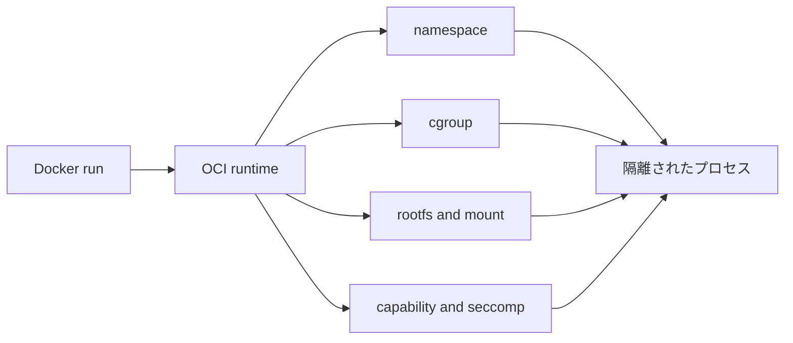

# Linux コンテナの仕組み

Docker を使ったことはあるが中身は曖昧、という読者向けに、Linux の仕組みからコンテナを理解する教材です。

## この教材で扱うこと

- process
- syscall
- user space / kernel space
- namespace
- cgroup / cgroup v2
- rootfs
- mount
- chroot
- pivot_root
- capability
- seccomp
- procfs
- sysfs
- OCI runtime
- runc / youki
- Docker がコンテナを起動する裏側の流れ

## 想定読者

- Linux 初学者
- プログラミング経験はある
- Docker は触ったことがある
- OCI runtime や `runc` / `youki` に興味がある

## 学習ゴール

- コンテナは VM ではなく、Linux の機能で隔離されたプロセスだと説明できる
- namespace が見える世界を分ける仕組みだと説明できる
- cgroup が使える資源を制限・計測する仕組みだと説明できる
- Docker / OCI runtime が Linux 機能をどう組み合わせるかを説明できる

## 読み方

1. 第1章で全体像を掴む
2. 第2章から第9章で仕組みごとに理解する
3. 第10章で対応関係を整理する
4. 確認問題とミニプロジェクトで定着させる

## 前提環境

- Ubuntu Server を想定
- `sudo` が使えること
- Docker の基本コマンドを少し触ったことがあると理解しやすい

## 章構成

- [第1章: コンテナの正体を先に掴む](/container-internals/01-overview)
- [第2章: process と /proc](/container-internals/02-process-and-proc)
- [第3章: syscall と user space / kernel space](/container-internals/03-syscall-and-kernel)
- [第4章: namespace](/container-internals/04-namespace)
- [第5章: mount / rootfs / chroot / pivot_root](/container-internals/05-mount-rootfs-chroot-pivot-root)
- [第6章: cgroup / cgroup v2](/container-internals/06-cgroup-v2)
- [第7章: capability](/container-internals/07-capability)
- [第8章: seccomp](/container-internals/08-seccomp)
- [第9章: OCI runtime / runc / youki](/container-internals/09-oci-runtime)
- [第10章: 全体まとめ](/container-internals/10-summary)
- [確認問題](/container-internals/questions)
- [解答と解説](/container-internals/answers)
- [ミニプロジェクト](/container-internals/mini-project)
- [次に読む資料](/container-internals/next-steps)

## 教材で使う図の形式

Mermaid で簡易図を置けるようにしてあります。

## このページで理解すべきこと

- 教材全体の範囲
- 読む順番
- 学習ゴール
- 実験前提の Ubuntu 環境
