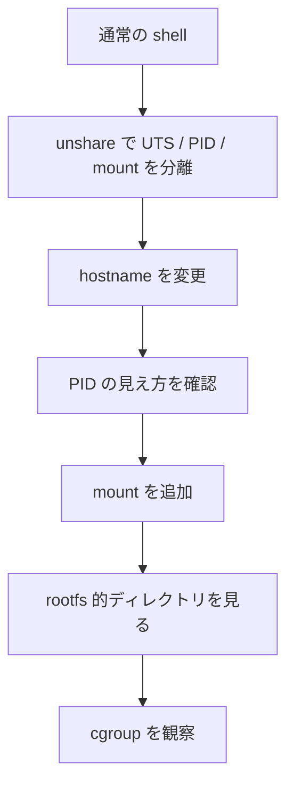

# ミニプロジェクト

このミニプロジェクトのテーマは次です。

::: tip テーマ
Docker を使わずに、Linux の機能だけでコンテナっぽい環境を作ってみる
:::

完全な container runtime を作る必要はありません。  
目的は「コンテナっぽさ」が、Linux のどの機能から生まれているかを手で確かめることです。

## ゴール

このミニプロジェクトを終えると、次のことを体験できます。

- `unshare` で namespace を分離できる
- hostname を変えると UTS namespace の意味が分かる
- PID namespace で `ps` の見え方が変わる
- mount namespace で mount 構成を分離できる
- rootfs 的な発想が理解できる
- cgroup の観察方法が分かる
- capability / seccomp は概念としてどこに効くか整理できる

## 前提環境

- Ubuntu Server
- `sudo` が使える
- `unshare`, `mount`, `ps`, `hostname` が利用できる
- systemd が有効なら cgroup 観察がしやすい

## 安全上の注意

::: danger 注意
この手順は安全性を重視しており、`/tmp` 配下や一時的 namespace を使います。  
それでも、`sudo` 付きコマンドは内容を確認してから実行してください。
:::

- `/tmp` 配下で作業する
- ホストの恒久設定は変更しない
- shell を抜ければ namespace 実験は終了する
- `rm -rf` は使わず、明示的なパスで片付ける

## 全体像



## Step 1: 事前観察

まず、現在の世界を観察します。

```bash
echo "shell pid: $$"
hostname
readlink /proc/$$/ns/pid
readlink /proc/$$/ns/mnt
readlink /proc/$$/ns/uts
cat /proc/self/cgroup
```

確認ポイント:

- 今の shell の PID
- 今の hostname
- 所属 namespace
- 所属 cgroup

## Step 2: UTS と mount namespace を分離した shell に入る

次のコマンドで新しい shell を開きます。

```bash
sudo unshare --uts --mount bash
```

入ったら確認します。

```bash
hostname
readlink /proc/$$/ns/uts
readlink /proc/$$/ns/mnt
```

ここでは、まだ hostname は元と同じに見えるかもしれません。  
大事なのは「別 namespace にいる」ことです。

## Step 3: hostname を変える

その shell の中で:

```bash
hostname mini-container
hostname
```

期待:

- その shell では `mini-container` に見える
- 外へ戻るとホスト hostname は変わっていない

別 terminal か、後で shell を抜けたあとに確認してください。

## Step 4: PID namespace も試す

今度は別のコマンドで PID namespace も分けます。

```bash
sudo unshare --pid --fork --mount-proc bash
```

中で:

```bash
echo $$
ps aux
```

期待:

- 自分が PID 1 に見えることがある
- `ps aux` で見える process 数が少ない

これで「見える process 世界」が変わることを体験できます。

## Step 5: mount namespace で自分だけの mount を作る

まず外側で準備します。

```bash
mkdir -p /tmp/mini-container/source
mkdir -p /tmp/mini-container/target
echo hello >/tmp/mini-container/source/hello.txt
```

次に mount namespace に入ります。

```bash
sudo unshare --mount bash
mount --bind /tmp/mini-container/source /tmp/mini-container/target
ls /tmp/mini-container/target
cat /tmp/mini-container/target/hello.txt
```

shell を抜けたあと、外側で:

```bash
ls /tmp/mini-container/target
```

を見て、見え方が変わるか確認します。

## Step 6: rootfs の考え方を理解する

ここでは本格的な `chroot` や `pivot_root` を実装するのではなく、「別の `/` を見せるにはファイル群が必要」という感覚をつかみます。

```bash
mkdir -p /tmp/mini-rootfs/bin
cp /bin/sh /tmp/mini-rootfs/bin/
ldd /bin/sh
```

観察ポイント:

- `/bin/sh` だけでは十分でない
- 共有ライブラリや `/etc` なども必要になる
- rootfs は「コマンド 1 個」ではなく「生活に必要な一式」

余力があれば:

```bash
docker run --rm ubuntu ls /
```

と比較して、「あれも rootfs の一例だ」と考えてください。

## Step 7: cgroup を観察する

次で現在の所属 cgroup を見ます。

```bash
cat /proc/self/cgroup
ls /sys/fs/cgroup | head
```

systemd が有効なら:

```bash
systemd-cgls | head -n 30
```

さらに可能なら:

```bash
systemd-run --user --scope -p MemoryMax=100M bash
```

新しい shell の中で:

```bash
cat /proc/self/cgroup
```

を見ます。

## Step 8: capability と seccomp は概念で整理する

このミニプロジェクトでは capability / seccomp の本格操作までは行いません。  
代わりに、次を確認してください。

```bash
cat /proc/$$/status | grep Cap
cat /proc/$$/status | grep Seccomp
```

Docker が使えるなら:

```bash
docker run --rm ubuntu bash -lc 'cat /proc/self/status | grep -E "Cap|Seccomp"'
```

ここで、「namespace だけでなく権限層も調整されている」ことを思い出します。

## ふりかえり

このミニプロジェクトで体験したことを、次の対応で説明できるか確認してください。

- hostname が変わった: UTS namespace
- `ps` の見え方が変わった: PID namespace
- mount が内側だけで見えた: mount namespace
- `/` を別にしたくなる: rootfs の必要性
- process 群を制御したくなる: cgroup
- root でも何でもできないようにしたい: capability
- syscall まで絞りたい: seccomp

## 発展課題

余力があれば、次を試してください。

1. Docker コンテナを起動し、ホストから `/proc/<pid>/ns/*` を見る
2. Docker コンテナの `cat /proc/self/cgroup` を見る
3. `docker inspect` の情報を、第9章の起動フローに対応付ける
